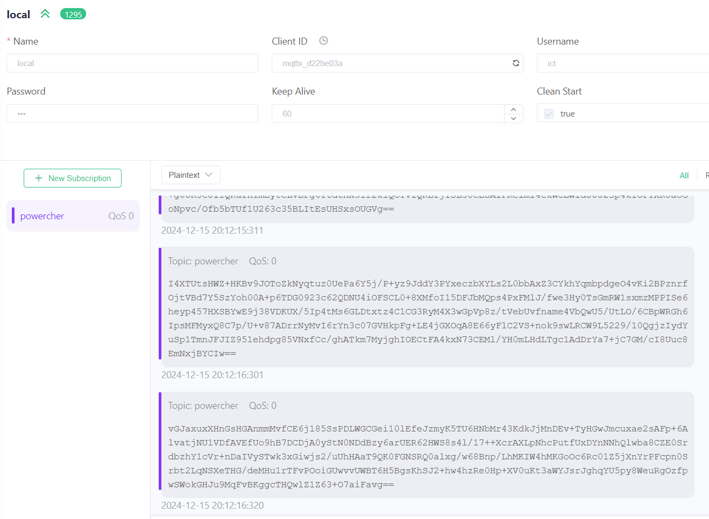

# Réseau de confiance

Il semble que nous soyons victimes de notre succès: des activités d'espionnage industriel ont été détectées autour de notre broker `mqtt.blue.section-inf.ch`.

Il est temps de protéger la moindre notre système.

Nous allons réaliser une étape simple mais rapide: chiffrer nos communication au moyen d'une clé de l'algorithme AES et d'une clé de 32 bytes.

Activité:

- Voici votre objectif:
    - La maison communique normalement avec Mère Nature, PowerDeal et PowerWatch
    - Un espion MQTTX ne voit passer que des messages chiffrés
    

- La démarche:
    - Vous créez une branche "confiance" dans votre repo. Vous êtes libres de tout changer (y compris le ce qui vient du repos central: Mère Nature, PowerDeal, PowerWatch, Backend, ...)
    - Vous enquêtez ! Seul, en groupes ou en une seule équipe.
    - Vous validez vos choix en me posant des questions fermées (ce qui veut dire que je réponds par oui ou non)
    - Vous essayez, expérimentez, ...
    - On s'arrête après une période maximum, on présente la solution la plus avancée
    - (Si besoin) on présente la solution officielle

- DoD
    - [ ] Mère Nature, PowerDeal et PowerWatch tournent sur un poste, connecté à `mqtt.blue.section-inf.ch`
    - [ ] Un client MQTTX montre que les messages émis sont cryptés
    - [ ] Il y a une fenêtre de monitoring PowerWatch par élève présent. (tolérance de -1)
    - [ ] Toutes les fenêtres de monitoring contiennent
        - Le nom de l'élève
        - L'heure de Mère Nature
        - Le montant en cash
    - [ ] Le système est stable dans cet état durant au moins 5 minutes