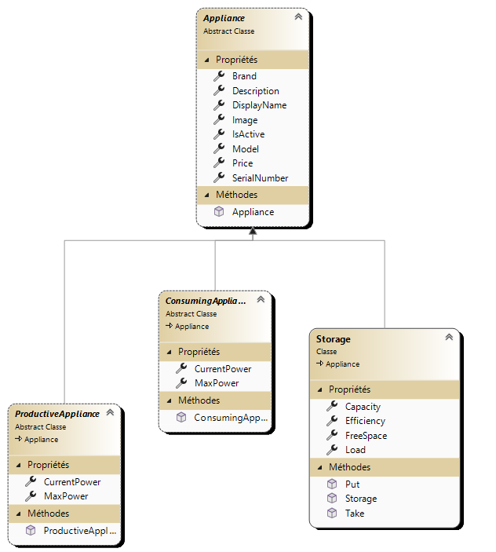

# Catalogue d'appareils électriques (appliances)



Vos maisons sont remplies d'appareils électriques. En voici un exemple de consommateur :

Un four à raclette :

```csharp
namespace DataModel.Catalog
{
    class MioStar400 : ConsumingAppliance
    {
        public MioStar400(string serialnumber, string displayName) 
            : base(serialnumber, displayName, "MioStar", "400", "Le four à raclette préféré des valaisans", 150, 1500)
        {
        }
    }
}
```

## Mission

Créer :
- Une classe pour un producteur d'énergie
- Deux classes pour des consommateurs
- Une classe pour un stockage

Allez chercher les infos sur le net pour avoir des appareils aux caractéristiques réelles.

Mise en commun : par un pull request spécifique contenant **UNIQUEMENT** les éléments électriques (pas HouseUI_...)
