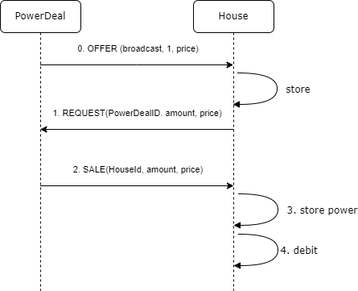

# PowerDeal

Votre maison a besoin d'énergie ? Voici comment faire

## UPS

Pour commencer, votre maison doit être équipée d'un Unbreakable Power Supply (UPS).  
Le seul modèle acceptable à ce jour est le [PCS100 UPS-I](https://new.abb.com/ups/fr-ch/onduleurs/onduleurs-triphases-industriels/pcs100-ups-i/donnees-techniques) d'ABB. Vous le trouverez dans les Storage de la dernière version du catalogue Powercher.

Votre maison doit également disposer d'un Energy Manager (EM). En termes de code, l'EM est une classe statique.
Son rôle consiste à :
1. Mettre l'énergie produite par les producteurs de la maison dans un storage de la maison ou dans l'UPS
2. Prendre l'énergie dans un storage de la maison ou dans l'UPS et la distribuer aux consommateurs
3. Si l'UPS est chargé à plus de 60%: vendre le surplus à PowerDeal pour revenir à 50%
4. Si l'UPS est chargé à moins que 40%: acheter l'énergie manquante à PowerDeal pour revenir à 50%

Si la charge de l'UPS dépasse les 100%, l'excédent est perdu, mais **ATTENTION!**, si la charge de l'UPS arrive à 0, c'est **GAME OVER** 

## Acheter de l'énergie à PowerDeal

Voici comment se déroule un achat:

Les messages échangés entre PowerDeal et la maison appartiennent à notre [protocole powercher](https://github.com/ETML-INF/powercher/tree/main/Backend/Protocol) (sur MQTT).

Les enveloppes des messages sont porteuses du type `MessageType.POWER` et d'un objet de type `PowerTransaction`

Le type de _transaction_ que propose le message est déterminé par la propriété `Type` de l'objet `PowerTransaction`: `SALE`, `PURCHASE`, `REQUEST` ou `OFFER` (de l'énumération `PowerTransactionType`)

0. PowerDeal diffuse continuellement le prix du kwh qu'il propose. L'offre est en broadcast (`PowerTransaction.Customer` est `null`)
1. La maison fait une demande à PowerDeal: un certain nombre de kwh (`amount`) pour un certain montant total (`price`)
2. PowerDeal vend l'énergie demandée. Normalement `amount` et `price` sont égaux à la demande. **Attention:** si le prix présenté est incompatible avec le prix annoncé par PowerDeal, il ne répondra même pas !!
3. La maison ajoute la puissance à son UPS
4. La maison déduit le montant de son cash (Attention: le cash de la maison étant publié, on peut vérifier que ça a été fait!)

## Vendre de l'énergie à PowerDeal

Le processus utilise les même mécanismes que ceux de l'achat:

1. La maison propose de l'énergie à PowerDeal: un certain nombre de kwh (`amount`) pour un certain montant total (`price`)
2. PowerDeal achète l'énergie. Normalement `amount` et `price` sont égaux à l'offre. **Attention:** PowerDeal n'accepte (ne répond à) une offre que si le prix proposé est **inférieur ou égal à la moitié de son prix de vente**. Si ce n'est pas le cas, il ne répondra même pas !!
3. La maison sort les kwh de son UPS
4. La maison encaisse le montant