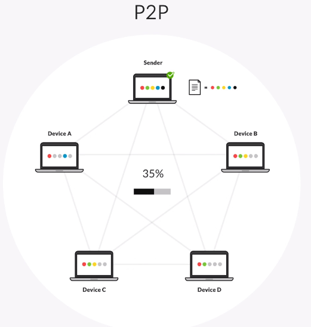
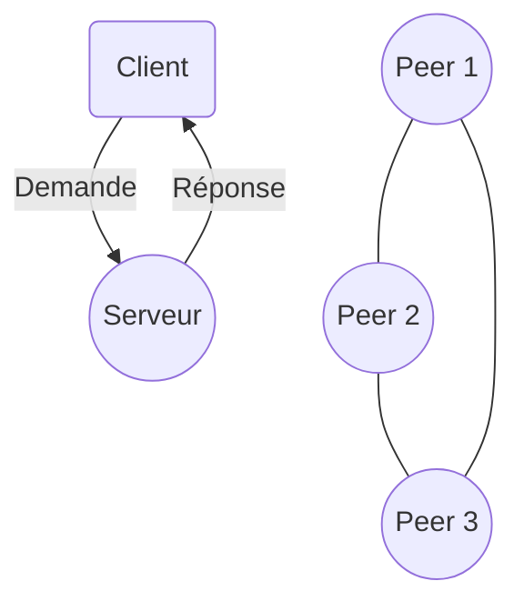
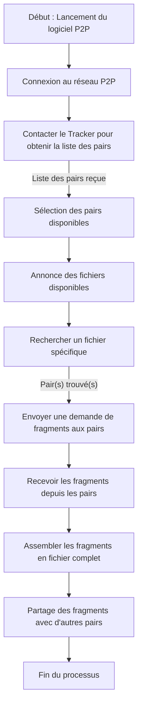

# Architecture P2P

## Définition des 2 architectures conventionnelles

### Architecture Client-Serveur
Un modèle où un client (ordinateur ou application) demande des services ou des données à un serveur centralisé, qui
répond aux requêtes.

- Exemple : Un utilisateur accède à une page web via un navigateur (client), le serveur web lui fournit la page.

### Architecture Peer-to-Peer (P2P)
Un modèle où chaque appareil (ou "peer") agit à la fois comme client et serveur. Tous les pairs peuvent partager
directement des données ou des ressources sans dépendre d’un serveur central.

- Exemple : Partage de fichiers via BitTorrent.

## Schéma

## Comparaison des deux architectures

| **Critère**         | **Client-Serveur**                                       | **Peer-to-Peer (P2P)**                                                  |
|---------------------|----------------------------------------------------------|-------------------------------------------------------------------------|
| **Structure**       | Centralisée : un serveur unique gère les clients.        | Décentralisée : chaque nœud peut interagir directement avec les autres. |
| **Performance**     | Dépend de la capacité du serveur.                        | Évolutive : plus de nœuds = plus de ressources disponibles.             |
| **Coût**            | Serveur coûteux à entretenir.                            | Moins cher, car pas de serveur dédié nécessaire.                        |
| **Fiabilité**       | Si le serveur tombe, tout le système est impacté.        | Résilient : un nœud défaillant n'affecte pas tout le réseau.            |
| **Sécurité**        | Plus facile à sécuriser, mais centralisé = cible unique. | Difficile à sécuriser : les pairs sont variés et dispersés.             |
| **Exemple d’usage** | Services web, emails, banques en ligne.                  | Partage de fichiers, blockchain, VoIP (Skype).                          |

## Avantages et inconvénients

**Architecture Client-Serveur :**

- *Avantages :*
    - Facilité de gestion et de maintenance.
    - La centralisation simplifie les mises à jour et la sécurité.
    - Bonne performance pour des systèmes de taille moyenne.

- *Inconvénients :*
    - Point de défaillance unique (**à nuancer notamment en utilisant [anycast](https://en.wikipedia.org/wiki/Anycast) et un cluster...**).
    - Coût élevé pour des serveurs robustes.
    - Scalabilité limitée si la charge augmente rapidement (en imaginant un besoin de synchronisation de données comme la session...).

**Architecture P2P :**

- *Avantages :*
    - Haute résilience grâce à l’absence de point central.
    - Facilité de partage direct de ressources.
    - Scalabilité naturelle avec l’ajout de nouveaux pairs.

- *Inconvénients :*
    - Gestion et sécurisation plus complexes.
    - Performance variable selon les pairs connectés.
    - Difficulté à contrôler les ressources distribuées.

---

## Exemples d’utilisation

- **Client-Serveur :**
    - Une application de banque en ligne où le serveur gère les comptes et transactions.
        - Le client se connecte, envoie une requête pour afficher son solde.
        - Le serveur traite la requête et renvoie les données au client.

- **P2P :**
    - Partage de fichiers avec BitTorrent.
        - Un utilisateur partage une vidéo. Les autres pairs téléchargent les fragments du fichier directement depuis
          plusieurs sources (pairs) en parallèle.

> [!IMPORTANT]  
> Une architecture "client-serveur" peut cacher une architecture plus complexe (cluster, cloud, ...) qui cumule certains
> avantages (et inconvénient surtout au niveau du coût et de la maintenance) des 2 architectures...
> Plus d’informations au chapitre [Design for failure](../supports/design4failure.md)

## Exemple de flux basique d’une application P2P

### Description des étapes principales

1. **Connexion au réseau P2P :**
- L'utilisateur lance le logiciel et se connecte au réseau.
- Le logiciel contacte un tracker ou utilise une table de routage (DHT) pour découvrir d'autres pairs.

2. **Annonce des fichiers disponibles :**
- Chaque pair informe le réseau des fichiers qu’il peut partager.

3. **Recherche de fichiers :**
- L'utilisateur effectue une recherche.
- Le logiciel identifie les pairs détenant le fichier ou ses fragments.

4. **Échange de fragments :**
- Une fois les pairs identifiés, des requêtes sont envoyées pour récupérer des fragments du fichier.
- Les fragments sont téléchargés de manière parallèle depuis différents pairs.

5. **Assemblage des fichiers :**
- Les fragments reçus sont vérifiés pour leur intégrité (hash) et assemblés pour recréer le fichier complet.

6. **Partage des fragments :**
- Pendant ou après le téléchargement, le logiciel partage à son tour les fragments téléchargés avec d'autres pairs.

7. **Fin du processus :**
- Une fois le fichier complet, le logiciel continue de partager les fragments tant que l'utilisateur reste connecté.

## Conclusion

Le choix entre P2P et Client-Serveur dépend des besoins spécifiques du système (scalabilité, coût, sécurité). Les deux
architectures ont leurs usages particuliers et se complètent souvent dans des environnements modernes.