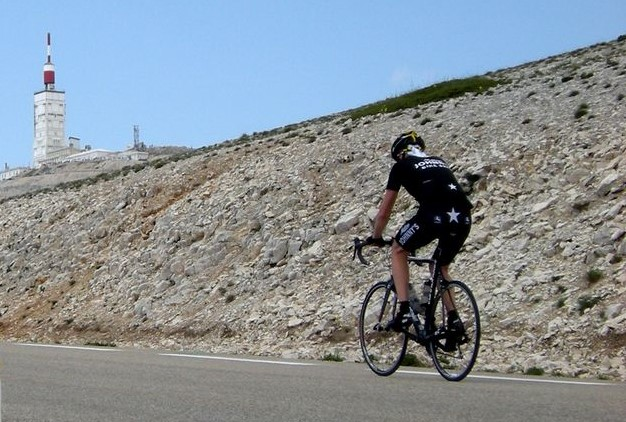
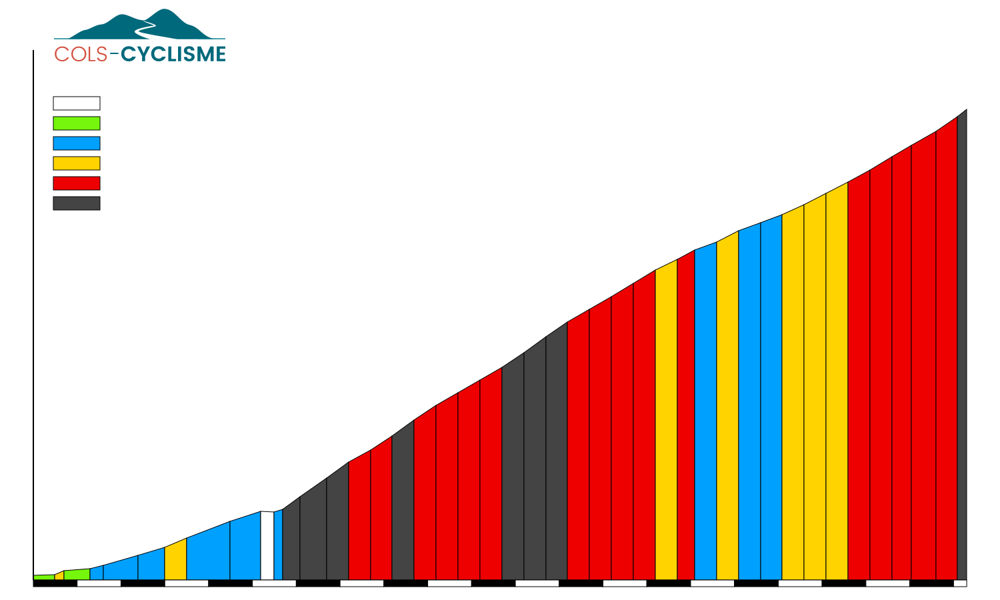

# Puissance et énergie

Regardez ce cycliste en train de gravir le Mont Ventoux 

ça n'en a pas l'air, mais la pente est raide (environ 10%)!

Pour monter à la vitesse de 15 Km/h, ce cycliste doit fournir une puissance d'environ 330 Watts.

C'est pas mal, mais ce n'est pas une performance incroyable s'il atteint cette vitesse mais ne la maintient pas.

**A retenir:** La puissance est mesurée en **Watt** (notation: `[W]`), de manière **instantanée**.

Par contre, s'il parvient à maintenir cette allure tout le long des 21km de la montée, chapeau !!!

Il sera très, très fatigué une fois arrivé au sommet, parce qu'il aura dépensé beaucoup d'**énergie**.

Oui, mais combien ? 

- A la vitesse de 15 km/h, il aura passé 21 / 15 = 1.4 heure (une heure et 24 minutes) sur son vélo.
- La puissance est fréquemment exprimée en Kilowatts (`[kW]`). Notre cycliste développe donc 0.33 `[kW]`
- Si on admet qu'il a réussi à maintenir cette puissance constante, il aura dépensé : 1.4 * 0.33 = 0.462 `[kWh]`

**A retenir:** L'énergie est mesurée en **Kilowattheures** (notation: `[kWh]`), sur une certaine **durée**.

A son retour chez lui, notre cycliste aura bien mérité une longue douche de 10 minutes, non ? eh bien s'il le fait, cela consommera environ 2.5 `[kWh]`!
