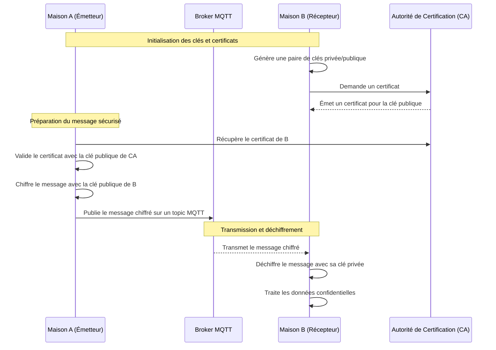
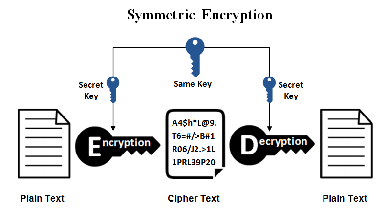

# Confidentialité

La **confidentialité** dans un réseau distribué consiste à garantir que seules les entités autorisées peuvent accéder
aux données échangées. Cela empêche les interceptions ou divulgations non autorisées.

## Principes clés de la confidentialité :

1. **Chiffrement des données** :
    - Les données sont chiffrées avant leur transmission, rendant leur contenu illisible pour toute entité ne possédant
      pas la clé de déchiffrement.
    - Types de chiffrement :
        - **Symétrique** : Une seule clé est utilisée pour le chiffrement et le déchiffrement.
        - **Asymétrique** : Une paire de clés (publique/privée) est utilisée.
2. **Authentification des parties** :
    - Les participants doivent s’authentifier pour s'assurer qu'ils sont bien autorisés à échanger les données.
3. **Protection en transit** :
    - Les données doivent rester confidentielles pendant leur transfert, même si le réseau est compromis.

## Exemple d’envoi de message avec des clés asymétriques

### Contexte :

- La maison A souhaite envoyer un message confidentiel contenant des données de consommation à la maison B via un broker
  MQTT.
- La confidentialité est assurée en chiffrant les données avec la clé publique de B.

### Étapes :

1. La maison A récupère la clé publique de B.
2. A chiffre le message avec la clé publique de B.
3. A s’authentifie au broker et envoie le message chiffré au broker MQTT.
4. Le broker transmet le message à B.
5. B s’authentifie au broker et déchiffre le message avec sa clé privée pour accéder aux données.

### Diagramme Mermaid pour la confidentialité

### Explications du processus

1. **Initialisation des clés et certificats** :
    - La maison B obtient un certificat de l'autorité de certification (CA), contenant sa clé publique.
    - La maison A utilise ce certificat pour s'assurer qu'elle envoie le message à la bonne entité.

2. **Chiffrement des données** :
    - La maison A chiffre le message avec la clé publique de B. Ce chiffrement garantit que seul B peut lire le message,
      grâce à sa clé privée.

3. **Transmission via MQTT** :
    - Le message chiffré est publié sur un topic MQTT.
    - Le broker MQTT relaie le message sans pouvoir accéder à son contenu, car il n’a pas la clé de déchiffrement.

4. **Déchiffrement et traitement** :
    - La maison B déchiffre le message avec sa clé privée et accède aux données en toute confidentialité.

## Avec clé symétrique
Le principe est similaire sauf qu’il faut se mettre d’accord sur la clé et que si celle-ci est compromise, tout le
réseau est compromis !

## Conclusion

La confidentialité protège les données échangées contre tout accès non autorisé, même si le réseau ou les
intermédiaires (comme le broker MQTT) sont compromis. En utilisant le chiffrement asymétrique, les échanges restent
sécurisés et accessibles uniquement à la maison destinataire.