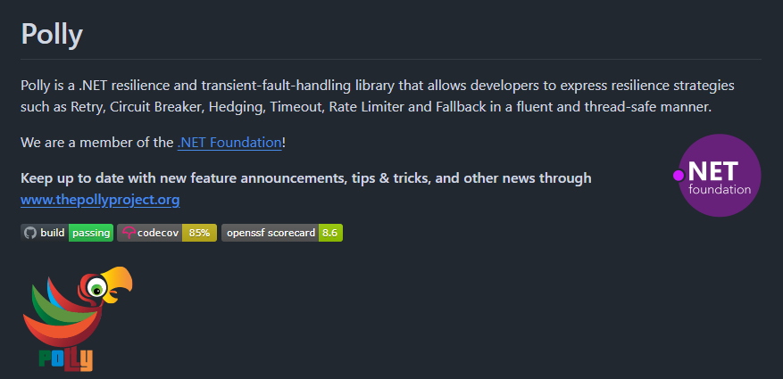
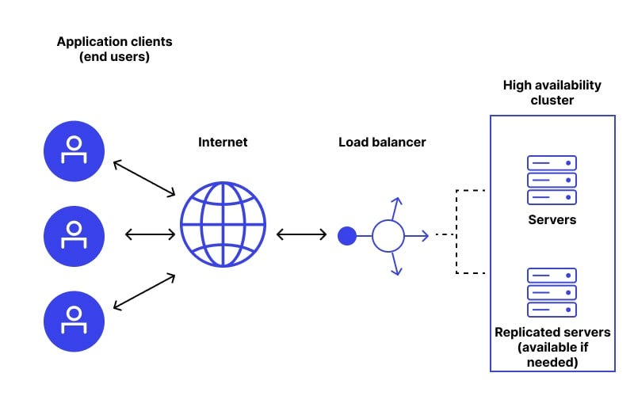
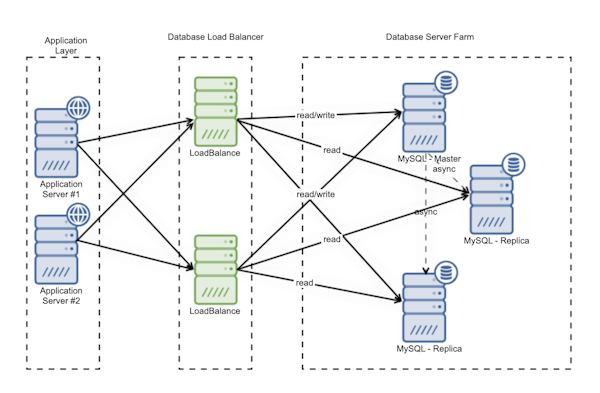
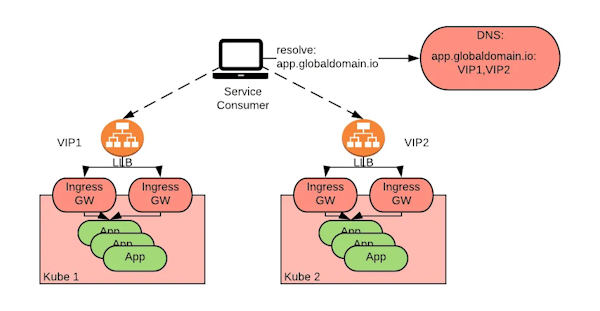

# Résilience ou Design for failure

Le concept de **design for failure** est crucial pour la résilience des systèmes distribués, en particulier dans une
application comme un réseau de maisons connectées qui désirent échanger de l’électricité et des fichiers multimédias
via MQTT dont voici une illustration qui ne manque pas de flou artistique :


## Résumé

Le thème étant relativement vaste, voici un résumé :

**Le concept de "Design for Failure"** est essentiel pour assurer la **résilience** des systèmes distribués. 

> **Définition**  
>   La résilience d'un système d'information est sa capacité à se récupérer rapidement et efficacement après une perturbation

Ce concept repose sur l'idée qu'aucun système n'est à l'abri des **pannes** (matérielles, logicielles ou réseau) et vise à concevoir des infrastructures capables **d’identifier les pannes**, **de se dégrader gracieusement** et **de se rétablir automatiquement**.

Les stratégies clés incluent la **redondance**, **fail fast**, l’utilisation de **clusters**, la mise en place 
de **failover**, et même la **répartition géographique** des composants. Des mécanismes comme les **timeouts**, 
les **circuit breakers**, ou encore les stratégies de **exponential backoff** permettent de limiter 
les **effets domino** et de préserver la stabilité du système.

Des concepts comme le **load balancing**, la **scalabilité horizontale et verticale**, et l'intégration avec des 
services cloud complètent une architecture résiliente.

En combinant ces approches, il est possible de construire un système capable de minimiser l'impact des pannes tout en
maintenant une **expérience utilisateur fluide**.

De manière métaphorique, on pourrait dire que `design for failure` équivaut à **`embrasser la loi de Murphy`**

---

## Design for Failure : Qu’est-ce que c’est ?


C'est une approche qui part du principe qu’aucun système n’est à l’abri des pannes. Cela inclut les défaillances
matérielles, logicielles, réseau ou humaines. Le but est de concevoir un système capable :

- **d’identifier** les pannes,
- **de se dégrader gracieusement** (sans interruption brutale du service),
- **de se rétablir automatiquement**.

Dans le contexte des maisons connectées, cela signifie que même si une maison ou un nœud central (serveur, broker MQTT)
tombe en panne, les autres maisons doivent pouvoir continuer à fonctionner et échanger des données.

## Stratégies générales

### **Tolérance aux Pannes**

1. **Redondance** : Ajouter plusieurs copies des composants critiques (serveurs, bases de données, brokers).
2. **Clusters** : Utiliser des clusters pour répartir la charge et éviter les SPOF (Single Point of Failure).
3. **Failover** : Passer automatiquement à une instance secondaire en cas de panne.
4. **Répartition Géographique** : Déployer des composants dans plusieurs régions pour éviter des pannes globales.

### **Détection et Isolation**

5. **Health Checks** : Surveiller l'état des composants pour détecter rapidement les pannes.
6. **Timeouts** : Définir des délais pour éviter des blocages en cas de réponse lente.
7. **Circuit Breakers** : Interrompre temporairement les appels à un composant défaillant pour éviter un effet domino.
8. **Retry avec Jitter** : Réessayer les opérations échouées de manière aléatoire pour éviter des surcharges.

> [!CAUTION]
> En cas de détection de panne, des [précautions sont à prévoir](#exponential-backoff-pour-retryjitter)

### Dégradation Gracieuse

9. **Modes Dégradés** : Fournir une version réduite du service en cas de problème.
10. **File d’Attente (Queueing)** : Utiliser des queues pour gérer les pics de trafic ou les retards.
11. **Cache** : Stocker temporairement des réponses pour éviter les appels répétés à des services défaillants.

### Récupération Automatique

12. **Restart Automatique** : Redémarrer automatiquement les composants en panne.
13. **Auto-scaling** : Ajouter ou retirer dynamiquement des ressources en fonction de la charge.
14. **Backups et Snapshots** : Maintenir des sauvegardes pour restaurer rapidement un état précédent.

### Surveillance et Analyse

15. **Monitoring Temps Réel** : Utiliser des outils comme Prometheus ou Grafana pour surveiller le système.
16. **Alertes** : Notifier les équipes en cas de défaillance détectée.
17. **Journalisation (Logging)** : Capturer des logs détaillés pour diagnostiquer les problèmes.

### Planification et Préparation

18. **Test de Pannes** : Simuler des défaillances avec des outils comme Chaos Monkey pour tester la résilience.
19. **Partitionnement** : Diviser les données et services pour limiter l’impact des pannes.
20. **Limiter la Blast Radius** : Isoler les composants pour minimiser l'effet d'une panne.
21. **Fallbacks** : Prévoir des solutions alternatives en cas de panne majeure.

### Conception Logicielle

22. **Idempotence** : Concevoir les opérations pour qu'elles puissent être répétées sans causer d'erreurs.
23. **Validation des Entrées** : Vérifier les données en entrée pour éviter des erreurs propagées.
24. **Fail Fast** : Détecter et signaler rapidement les erreurs dès qu’elles surviennent.
25. **Statelessness** : Favoriser des composants sans état pour faciliter la reprise après une panne.

### Cloud et Infrastructure

26. **Auto-healing** : Configurer les infrastructures cloud pour détecter et remplacer automatiquement les instances
    défaillantes.
27. **Multi-cloud** ou **Hybride** : Répartir les services sur plusieurs fournisseurs de cloud.
28. **Load Balancing** : Répartir le trafic pour éviter la surcharge d’un composant unique.
29. **Réplication** : Répliquer les données et services sur plusieurs machines ou régions.
30. **Scalabilité** : réagir à la demande, [plus de détails ici](#scalabilité-horizontale-et-verticale)

### Sécurité

31. **Quotas** et **Limitations** : Empêcher un utilisateur ou un processus de monopoliser les ressources.
32. **Isolation des Défaillances** : Utiliser des conteneurs ou des environnements isolés pour limiter les impacts.
33. **Protéger** le système contre des menaces externes et internes

Chaque stratégie peut être adaptée en fonction des besoins spécifiques du système et du contexte !

## Compléments sur certaines stratégies

### Fail Fast

**Fail fast** signifie : "échouer rapidement et visiblement". L’idée est de détecter les défaillances dès qu’elles se
produisent, avant qu’elles ne s’aggravent ou affectent d’autres composants du système. Cela permet de :

- Identifier les causes de l’échec plus facilement.
- Réduire les temps d’indisponibilité.
- Préserver les ressources en évitant des calculs inutiles ou des états corrompus.

Dans un système distribué, cela implique que chaque composant (maison connectée, broker MQTT, etc.) doit vérifier ses
préconditions et signaler immédiatement un problème en cas de défaillance.

#### Fail Fast et MQTT

- Exemple avec les messages :
    - Si une maison publie un message mal formaté ou non conforme au protocole, le broker MQTT doit immédiatement
      rejeter ce message (et potentiellement notifier l’émetteur) plutôt que d’essayer de le traiter ou de le
      transmettre à d'autres abonnés.
    - Un mécanisme de "dead-letter queue" peut être mis en place pour isoler ces messages erronés.

- Fail fast dans le QoS :
    - Un client MQTT configuré avec QoS 2 (exactly once) doit détecter et signaler rapidement tout problème dans le
      cycle d’échange de messages (e.g., ACK manquant) pour éviter des transmissions incorrectes ou infinies.

#### Fail Fast et P2P

- **Détection de nœuds défaillants :**
    - Dans un réseau P2P, un nœud qui n’est plus joignable ou qui répond lentement doit être marqué comme inactif
      rapidement pour ne pas ralentir le reste du réseau.
    - Des mécanismes comme les *timeouts* et les pings réguliers peuvent être utilisés pour détecter les défaillances.

- Échange de fichiers multimédias :
    - Si une maison demande un fichier à un nœud P2P et que ce nœud ne peut pas répondre (panne ou donnée corrompue), la
      requête doit échouer immédiatement, et le système doit tenter une nouvelle requête vers un autre nœud en utilisant
      un [exponential backoff](#exponential-backoff-pour-retryjitter)

#### Fail Fast et Cloud

- **Services managés :**
    - Les services cloud comme les bases de données ou les brokers MQTT managés doivent signaler rapidement tout
      problème (e.g., quotas dépassés, erreurs réseau, indisponibilité d'une région) pour que l’application cliente
      puisse réagir.

- **Mécanismes cloud-native :**
    - Les orchestrateurs comme Kubernetes implémentent le fail fast en détectant rapidement les conteneurs qui ne
      répondent pas correctement (via des probes de santé) et en les redémarrant ou en les remplaçant.

#### Fail Fast et Clusters

- **Surveillance des nœuds :**
    - Dans un cluster de brokers MQTT ou d’autres services, les nœuds doivent être surveillés activement. Si un nœud
      échoue à traiter les requêtes ou devient non réactif, il doit être retiré du cluster immédiatement pour éviter une
      dégradation du service.

- **Load balancer et fail fast :**
    - Un load balancer avec des *health checks* peut détecter rapidement si une instance est défaillante et arrêter d’y
      rediriger du trafic.

#### Fail Fast et Scalabilité

- **Horizontale :**
    - Si une nouvelle instance est ajoutée pour augmenter la capacité mais ne parvient pas à démarrer correctement ou à
      gérer des connexions, elle doit être marquée comme défaillante immédiatement et retirée de l'infrastructure.

- **Verticale :**
    - Lorsqu’une instance existante dépasse ses limites (e.g., mémoire insuffisante, CPU saturé), des alertes doivent
      être générées rapidement pour déclencher une intervention ou un redimensionnement.

#### Stratégies pour Implémenter le Fail Fast

##### Validation stricte des entrées

- Avant d’accepter un message ou une commande, chaque composant doit vérifier :
    - Le format (par exemple, JSON correctement structuré).
    - La conformité avec les protocoles attendus (e.g., MQTT ou P2P).

#### Time-outs bien définis

- Les requêtes vers des services externes (nœuds P2P, brokers MQTT, etc.) doivent avoir des délais limites (timeouts)
  pour éviter des blocages.

#### Probes de santé

- Implémenter des mécanismes réguliers pour vérifier l’état des composants, par exemple :
    - *Liveness probe* : Le composant fonctionne-t-il encore ?
    - *Readiness probe* : Le composant est-il prêt à accepter des requêtes ?

#### Alertes et journalisation

- Lorsqu’un composant échoue rapidement, il doit :
    - Générer des logs détaillés pour faciliter le diagnostic.
    - Émettre des alertes aux opérateurs via des systèmes de monitoring (Prometheus, Grafana, etc.).

#### Avantages et Limites du Fail Fast

##### Avantages

- **Détection rapide des problèmes :** Les bugs et les défaillances sont identifiés tôt, limitant leur propagation.
- **Réduction des coûts :** Les ressources ne sont pas gaspillées dans des traitements inutiles.
- **Amélioration de la résilience :** Le système peut réagir rapidement aux échecs et maintenir sa stabilité.

##### Limites

- **Risque de sur-réactivité :** Des mécanismes trop sensibles peuvent entraîner des fausses alertes ou une dégradation
  inutile du service.
- **Complexité accrue :** Implémenter le fail fast nécessite une conception rigoureuse, avec des outils de surveillance
  et de récupération appropriés.

---

### Exponential backoff pour Retry/Jitter

En cas de détection de panne,
**Exponential Timeout** (ou backoff exponentiel) est une stratégie utilisée pour gérer les échecs ou les ralentissements
d’un système en espaçant progressivement les tentatives de reconnexion après une défaillance. Cela réduit
la pression sur le système et évite des surcharges inutiles.

#### Principe

- Après un échec, le délai avant de réessayer augmente de manière exponentielle, par exemple :
    - Première tentative : 1 seconde.
    - Deuxième tentative : 2 secondes.
    - Troisième tentative : 4 secondes.
    - Quatrième tentative : 8 secondes, etc.
- La durée maximale (appelée **backoff cap**) est définie pour éviter un délai infini.

#### Exemple

Supposons une maison connectée qui envoie ses données de consommation énergétique à un broker MQTT. Si le broker est
temporairement indisponible :

1. **Tentative 1** : La maison essaie immédiatement d’envoyer ses données.
    - Résultat : Échec.
    - Action : Attendre 1 seconde avant la deuxième tentative.

2. **Tentative 2** : La maison réessaie après 1 seconde.
    - Résultat : Toujours échec.
    - Action : Attendre 2 secondes avant la troisième tentative.

3. **Tentative 3** : Nouvelle tentative après 2 secondes.
    - Résultat : Succès ! Les données sont transmises avec succès.

#### Avantages

- Réduit le risque de surcharge du système (surtout si plusieurs clients réessaient en même temps).
- Donne au système défaillant le temps de récupérer.

#### Bonnes Pratiques

- **Ajouter un jitter (aléatoire)** : Varier légèrement les délais pour éviter que plusieurs clients réessaient
  exactement en même temps.
- **Limiter les tentatives** : Arrêter après un certain nombre d’essais pour éviter des boucles infinies.

Le concept de **fail fast** est une approche complémentaire à la **résilience** et au **design for failure**, qui
consiste à détecter les problèmes le plus rapidement possible pour minimiser leur impact sur le système global. Voici
une exploration théorique et pratique du fail fast, contextualisée dans le cas d’une application pour maisons connectées
utilisant MQTT, P2P, le cloud, et des clusters.

---

### Circuit breaker
Le **circuit breaker** est un design pattern utilisé dans les systèmes distribués pour **protéger
les services critiques** et éviter un effet domino en cas de défaillance. Inspiré des disjoncteurs électriques, il agit
comme une protection qui **interrompt temporairement les appels** à un service défaillant.

#### Comment fonctionne un Circuit Breaker ?

Un circuit breaker passe par trois états principaux :

1. **Closed (Fermé)** :
    - Le service fonctionne normalement.
    - Les requêtes sont transmises au service cible.

2. **Open (Ouvert)** :
    - Si un certain nombre d’échecs consécutifs sont détectés (selon un seuil défini), le circuit passe en 
    - mode **ouvert**.
    - Les requêtes ne sont plus envoyées au service cible mais échouent immédiatement, évitant une surcharge inutile.

3. **Half-Open (Semi-ouvert)** :
    - Après un délai défini, le circuit tente d’envoyer quelques requêtes (appelées *test probes*) en suivant
      [l’exponential backoff](#exponential-backoff-pour-retryjitter).
    - Si ces requêtes réussissent, le circuit repasse à **closed**.
    - Sinon, il reste en mode **open** pour un nouveau délai.


## Exemple

Un service d'une maison connectée envoie des données de consommation à un broker MQTT. Si le broker rencontre des
problèmes (latence élevée ou panne), un circuit breaker protège la maison contre des appels inutiles.

1. **Fermé :**
    - La maison envoie les données normalement.
    - Si des échecs surviennent, ils sont comptabilisés.

2. **Ouvert :**
    - Si le nombre d’échecs atteint un seuil (par exemple 5 échecs consécutifs), le circuit s’ouvre.
    - Les requêtes suivantes échouent immédiatement pour préserver les ressources.

3. **Semi-ouvert :**
    - Après [N secondes](#exponential-backoff-pour-retryjitter), une requête de test est envoyée.
    - Si cette requête réussit, le circuit se referme et les requêtes normales reprennent.


## **Avantages du Circuit Breaker**

- **Protection des services :** Empêche la surcharge des services défaillants.
- **Préservation des ressources :** Évite des appels inutiles et coûteux à des services en panne.
- **Amélioration de la résilience :** Réduit le risque d’effet domino dans les systèmes distribués.

## **Outils et Implémentations**



- **Libraries** :
    - Resilience4j (Java)
    - Polly (C#)
    - Hystrix de Netflix (déprécié mais inspirant)

- **Cloud-Native** :
    - Istio (Service Mesh)
    - Envoy Proxy

## Résilience appliquée

Comment intégrer la résilience dans un réseau distribué ❓

### MQTT (Message Queuing Telemetry Transport)

- **Rétention des messages** : Les brokers MQTT peuvent conserver les messages (avec le flag *retain*) pour
  s’assurer que les nouveaux abonnés reçoivent les dernières données.
- **QoS (Quality of Service)** : Les niveaux QoS (0, 1, 2) garantissent des niveaux variés de fiabilité dans la
  livraison des messages.
- **Clusters de brokers MQTT** : Répartir les brokers en cluster pour éviter un point unique de défaillance (Single
  Point of Failure - SPOF).

#### Mise en place d’un cluster avec RabbitMQ

1. **Installer RabbitMQ sur plusieurs serveurs** :

2. **Configurer les nœuds pour le clustering** :
    - Édite le fichier de configuration pour chaque instance (`rabbitmq.conf`) et spécifie un nom unique pour chaque
      nœud :
      ```
      node.name = rabbit@<hostname>
      ```
    - Configure chaque machine pour qu'elles se voient (vérifie la connectivité réseau et les noms DNS).

3. **Connecter les nœuds** :
    - Démarre RabbitMQ sur chaque nœud.
    - Ajoute les nœuds au cluster depuis un nœud principal avec la commande :
      ```
      rabbitmqctl join_cluster rabbit@<autre_nœud>
      ```

4. **Tester le cluster** :
    - Vérifie que tous les nœuds sont connectés avec :
      ```
      rabbitmqctl cluster_status
      ```

5. [Load balancing (optionnel et externe)](#load-balancing) :
    - Ajoute un load balancer pour répartir la charge entre les nœuds MQTT.

### Load Balancing
Le load balancing, garantit que la **charge est équilibrée**.



<details>
<summary>En quoi ce schéma n’est-il pas résilient ?</summary>

Que se passe-t-il si le load balancer n’a plus de RAM ou d’alimentation ?
</details>

##### Lien étroit avec le cluster

Les clusters permettent de répartir la charge entre plusieurs instances d’un service
([cluster rabbpiMQ](#mise-en-place-dun-cluster-avec-rabbitmq)) et le load balancer
permet de cibler les instances...



> [!TIP]
> Un load balancer devrait aussi être résilient, à l’image du schéma suivant :



### Peer-to-Peer (P2P)

- **Pourquoi P2P ?**  
  Dans un réseau de maisons connectées, un modèle décentralisé en P2P peut compléter ou remplacer un modèle centralisé
  basé sur un broker. Chaque maison peut jouer un rôle dans la transmission des messages ou la gestion des données.

- **Design for Failure avec le P2P :**
    - Redondance des données entre les maisons pour éviter la perte en cas de panne d’un nœud.
    - Capacité à réélire un nœud leader si le nœud actuel tombe (élection dynamique).

### Cloud

- **Pourquoi le cloud ?**  
  Le cloud permet de déployer les brokers MQTT et autres composants critiques de manière `élastique`, avec une tolérance
  aux pannes intrinsèque grâce à des mécanismes comme la réplication, le failover, la sauvegarde et la scalabilité.

- Rappel : une architecture Cloud est distribuée par nature et ce `cloud` peut être privé ou public...

- **Design for Failure avec le cloud :**
    - Déployer plusieurs instances de services sur différentes zones géographiques pour éviter une panne globale.
    - Utiliser des services cloud managés comme Amazon IoT Core, Google Cloud IoT, ou Azure IoT Hub pour réduire les
      risques liés à la gestion manuelle.
    - Utiliser Kubernetes avec notamment ingress :


#### Scalabilité Horizontale et Verticale

On peut `augmenter` et `diminuer` une infrastructure de 2 manières :

##### Scalabilité horizontale

Ajouter des instances pour gérer une augmentation du nombre de maisons connectées ou de fichiers échangés.

##### Scalabilité verticale

Augmenter les capacités d’une instance existante (e.g., plus de RAM, CPU).

##### Design for Failure et scalabilité

- Lors de pics de charge, la scalabilité garantit que le système reste fonctionnel.
- Prévoir une capacité minimale pour éviter des effets domino où une surcharge entraîne des pannes en cascade.

> [!WARNING]  
> Attention aux coûts variables liés à l’infrastructure cloud (dans le cas d’un cloud non privé)

## Scénarios

1. Powerdeal (IoT et MQTT) :
    - Une maison produit trop d’énergie et publie une offre pour l’excédent sur le broker MQTT.
    - En cas de panne du broker principal, un broker secondaire dans un cluster prend automatiquement le relais.
    - Si aucune connexion n’est disponible, les maisons se connectent en P2P pour continuer l’échange
      d’électricité.

2. Gestion des pannes :
    - Une maison perd sa connexion : elle stocke les messages localement (mode offline) et les synchronise quand la
      connexion est rétablie.
    - Un nœud critique tombe : le système détecte la panne et réoriente les messages vers un autre nœud grâce à un load
      balancer.

## Synthèse

En combinant **fail fast** et **design for failure**, on obtient un système qui est non seulement résilient face aux
pannes, mais aussi réactif dans leur détection, minimisant les impacts pour les utilisateurs finaux.
On peut donc construire un système robuste et résilient qui résiste aux pannes tout en garantissant
une expérience fluide pour les utilisateurs. La clé est **d’anticiper** les défaillances
et de s’assurer que chaque composant critique dispose de mécanismes de tolérance aux pannes.


> [!IMPORTANT]  
>Que retenir de tout ça ?
>**Anticiper les échecs, les accepter, et concevoir des systèmes résilients capables de s'adapter et de se 
>rétablir pour garantir leur fonctionnement.**