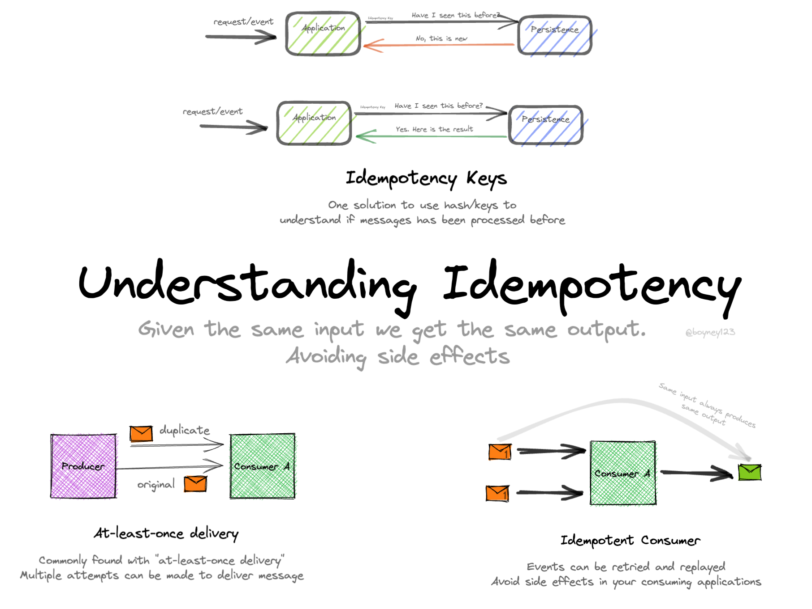

# IdemPotence


## Définition

L'idempotence est une propriété d'une opération qui garantit qu'appliquer cette opération **une ou plusieurs fois**
produit
le **même** résultat. Dans un contexte de microservices, cela est particulièrement important pour éviter des actions
répétées lors d'erreurs ou de re-transmissions de messages.

## Importance dans un système avec MQTT

MQTT est un protocole léger conçu pour la communication entre appareils, souvent utilisé pour des systèmes IoT. Étant
donné qu'il repose sur un modèle de publication/souscription, des messages peuvent être reçus plusieurs fois.
Cela nécessite que les consommateurs des messages soient capables de traiter ces derniers de manière
idempotente.

<details>
<summary>Quel(s) QOS(s) de MQTT impliquent obligatoirement un traitement de l’idempotence</summary>
QOS1
</details>

## Idempotence avec HTTP PUT et POST pour ajouter un élément dans une base de données

Selon les [spécifications HTTP](https://www.rfc-editor.org/rfc/rfc9110.html), les méthodes **PUT** et **POST** ont des
comportements différents en ce qui concerne l'idempotence :

---

### **POST : Non idempotent**

- La méthode **POST** est utilisée pour **créer une ressource** sur le serveur.
- Chaque requête **POST** crée une nouvelle ressource. Si la même requête est envoyée plusieurs fois, plusieurs
  ressources identiques peuvent être créées, sauf si des mesures spécifiques sont prises.

#### Exemple de comportement non idempotent avec **POST** :

1. Requête :
   ```http
   POST /api/items
   Content-Type: application/json

   {
       "name": "item1",
       "value": 100
   }
   ```
2. Résultat : Chaque fois que la requête est exécutée, un nouvel élément est ajouté avec un **nouvel identifiant généré
   par le serveur** (ex. ID unique ou clé primaire).

---

### **PUT : Idempotent**

- La méthode **PUT** est utilisée pour **créer ou remplacer** une ressource à un emplacement spécifique.
- Si la même requête **PUT** est envoyée plusieurs fois avec les mêmes données, l'état final sur le serveur reste le
  même.

#### Exemple de comportement idempotent avec **PUT** :

1. Requête :
   ```http
   PUT /api/items/123
   Content-Type: application/json

   {
       "name": "item1",
       "value": 100
   }
   ```
2. Résultat : Peu importe le nombre de fois que cette requête est envoyée, elle mettra à jour ou créera l'élément avec
   l'**ID 123**, sans duplication.

---

### Comparaison des cas pratiques

| **Aspect**                     | **POST**                     | **PUT**                                     |
|--------------------------------|------------------------------|---------------------------------------------|
| **Idempotence**                | Non idempotent               | Idempotent                                  |
| **Usage principal**            | Créer une nouvelle ressource | Créer ou remplacer une ressource spécifique |
| **Résultat si répété**         | Plusieurs ressources créées  | Toujours le même état de la ressource       |
| **Nécessité d’un identifiant** | Généré par le serveur        | Fourni par le client                        |

---

### Implémentation C# dans une API REST

#### Exemple de **POST** pour ajouter un élément

Chaque requête **POST** génère un nouvel élément :

```csharp
[HttpPost]
[Route("api/items")]
public IActionResult CreateItem([FromBody] ItemDto item)
{
    var newItem = new Item
    {
        Id = Guid.NewGuid(), // Génération d'un ID unique
        Name = item.Name,
        Value = item.Value
    };

    _dbContext.Items.Add(newItem);
    _dbContext.SaveChanges();

    return CreatedAtAction(nameof(GetItem), new { id = newItem.Id }, newItem);
}
```

#### Exemple de **PUT** pour ajouter ou remplacer un élément

Chaque requête **PUT** met à jour ou crée un élément avec le même ID :

```csharp
[HttpPut]
[Route("api/items/{id}")]
public IActionResult UpsertItem(Guid id, [FromBody] ItemDto item)
{
    var existingItem = _dbContext.Items.Find(id);

    if (existingItem == null)
    {
        // Création d'un nouvel élément si l'ID n'existe pas
        var newItem = new Item
        {
            Id = id, // ID fourni par le client
            Name = item.Name,
            Value = item.Value
        };

        _dbContext.Items.Add(newItem);
    }
    else
    {
        // Mise à jour de l'élément existant
        existingItem.Name = item.Name;
        existingItem.Value = item.Value;
    }

    _dbContext.SaveChanges();

    return Ok();
}
```

---

### Points importants

1. **Garantie d'idempotence avec PUT** :
    - La méthode **PUT** nécessite que le client spécifie l'ID ou l'URL exacte de la ressource cible. Cela permet de
      garantir que la même requête n'entraîne pas de duplications.

2. **Détection des doublons avec POST** :
    - Pour éviter les doublons avec **POST**, il est possible d'inclure un identifiant unique (par ex., un UUID) dans le
      corps de la requête ou comme en-tête HTTP, puis de vérifier cet identifiant côté serveur.

   Exemple de vérification :
   ```csharp
   if (_dbContext.Items.Any(x => x.ClientRequestId == item.ClientRequestId))
   {
       return Conflict("Duplicate request");
   }
   ```

3. **Scénarios d'usage recommandés** :
    - Utilisez **POST** lorsque le serveur doit contrôler l'ID ou générer des ressources uniques.
    - Utilisez **PUT** lorsque le client doit contrôler ou mettre à jour une ressource spécifique.

---

En résumé, **POST** est utile pour les créations non idempotentes (par exemple, ajouter une nouvelle commande ou un
utilisateur), tandis que **PUT** est préféré pour des opérations qui doivent garantir qu'il n'y a pas d'effet cumulé en
cas de répétition (comme une mise à jour ou une création par ID).

### Gestion Idempotente avec Demande d'ID Avant Création

Dans cette approche, le client demande d'abord un **ID unique** au serveur via une requête dédiée. Cet ID est ensuite
utilisé pour envoyer une requête **PUT** ou **POST** afin de créer une nouvelle ressource. Cette stratégie **garantit que
les requêtes répétées ne créent pas de doublons**.

---

### Processus en Deux Étapes

1. **Étape 1** : Le client demande un ID au service.
    - Le serveur génère un **ID unique** (par exemple, un GUID) et le retourne au client.
2. **Étape 2** : Le client utilise cet ID pour envoyer la requête de création.

---

### Exemple : API REST en C#

#### Étape 1 : Générer un ID unique

Le service expose un point de terminaison pour générer un **ID** :

```csharp
[HttpGet]
[Route("api/items/new-id")]
public IActionResult GenerateNewId()
{
    var newId = Guid.NewGuid(); // Générer un ID unique
    return Ok(newId);           // Retourner l'ID au client
}
```

**Exemple de réponse :**

```json
"e5c8a7d0-5f6a-44b2-9a3e-ff5a89b85dcb"
```

---

#### Étape 2 : Créer un nouvel élément avec un ID fourni par le client

Le client utilise l'ID pour envoyer une requête **PUT** ou **POST**.

##### Avec **PUT** (Idempotent)

```csharp
[HttpPut]
[Route("api/items/{id}")]
public IActionResult CreateOrUpdateItem(Guid id, [FromBody] ItemDto item)
{
    var existingItem = _dbContext.Items.Find(id);

    if (existingItem == null)
    {
        // Création d'un nouvel élément si l'ID n'existe pas
        var newItem = new Item
        {
            Id = id, // ID fourni par le client
            Name = item.Name,
            Value = item.Value
        };

        _dbContext.Items.Add(newItem);
    }
    else
    {
        // Mise à jour de l'élément existant
        existingItem.Name = item.Name;
        existingItem.Value = item.Value;
    }

    _dbContext.SaveChanges();

    return Ok();
}
```

##### Avec **POST** (Non Idempotent)

Pour **POST**, le serveur doit vérifier si l'élément avec cet ID existe déjà avant de créer un nouvel élément. Cela rend
le **POST** idempotent dans ce cas précis.

```csharp
[HttpPost]
[Route("api/items")]
public IActionResult CreateItem([FromBody] ItemDto item)
{
    // Vérifier si l'ID existe déjà
    var existingItem = _dbContext.Items.Find(item.Id);

    if (existingItem != null)
    {
        return Conflict("Item already exists with this ID.");
    }

    var newItem = new Item
    {
        Id = item.Id, // ID fourni par le client
        Name = item.Name,
        Value = item.Value
    };

    _dbContext.Items.Add(newItem);
    _dbContext.SaveChanges();

    return CreatedAtAction(nameof(GetItem), new { id = newItem.Id }, newItem);
}
```

---

### Exemple Côté Client

#### Étape 1 : Demander un nouvel ID

```csharp
var httpClient = new HttpClient();
var response = await httpClient.GetStringAsync("https://api.example.com/api/items/new-id");

var newId = Guid.Parse(response); // Extraire l'ID unique
```

#### Étape 2 : Créer un élément avec l'ID reçu

##### Avec **PUT** :

```csharp
var newItem = new
{
    Id = newId,
    Name = "item1",
    Value = 100
};

var putResponse = await httpClient.PutAsJsonAsync($"https://api.example.com/api/items/{newId}", newItem);
```

##### Avec **POST** :

```csharp
var newItem = new
{
    Id = newId,
    Name = "item1",
    Value = 100
};

var postResponse = await httpClient.PostAsJsonAsync("https://api.example.com/api/items", newItem);
```

---

### Points Clés

1. **Pourquoi cette approche ?**
    - **Idempotence garantie** : Le client utilise un ID unique généré par le serveur pour éviter les doublons.
    - **Contrôle partagé** : Le serveur conserve le contrôle sur les ID, mais le client les connaît avant de soumettre
      la requête.

2. **Validation côté serveur :**
    - Toujours vérifier si un élément avec l'ID existe déjà pour éviter les duplications.
    - Les requêtes répétées (PUT ou POST) avec le même ID ne doivent pas créer de nouveaux éléments.

3. **Flexibilité avec PUT ou POST :**
    - **PUT** convient lorsque le client contrôle explicitement l'ID et l'URL de la ressource.
    - **POST** peut être adapté pour inclure un ID, mais nécessite des validations supplémentaires.

---

### Scénarios Typiques

- **Création d'un utilisateur** :
  Le client demande un ID pour l'utilisateur avant de le créer, garantissant que les requêtes répétées ne créent pas
  plusieurs comptes.

- **Création de commandes ou transactions** :
  Les clients génèrent un ID unique (ou utilisent celui fourni par le serveur) pour garantir qu'une commande répétée ne
  soit pas créée plusieurs fois.


## Exemple avec l'application C# et le modèle `TownEnvironment`

Lorsque le microservice reçoit un message décrivant l'environnement d'une ville, on doit s’assurer que :

1. Si un message est reçu plusieurs fois, il ne provoque pas de duplication ou de modification incorrecte de l'état dans
   le système.
2. Les messages sont bien traités même s'il y a des erreurs ou des retransmissions.

### Stratégies pour garantir l'idempotence

1. **Ajout d'un identifiant unique au message**  
   Chaque message MQTT publié doit contenir un identifiant unique (`MessageId`). Par exemple :
   ```json
   {
       "MessageId": "abc123",
       "DateTime": "2024-11-15T12:00:00Z",
       "Clouds": 50,
       "SolarEnergy": 70,
       "WindSpeed": 10,
       "WindDirection": "N"
   }
   ```
    - Cet identifiant permet de détecter si un message a déjà été traité par le consommateur.

2. **Vérification de l'idempotence côté consommateur**
   Lors de la réception d'un message, vous pouvez utiliser une base de données ou un cache pour stocker les `MessageId`
   déjà traités. Exemple en C# :
   ```csharp
   private static readonly HashSet<string> ProcessedMessages = new();

   public void ProcessMessage(TownEnvironment environment, string messageId)
   {
       if (ProcessedMessages.Contains(messageId))
       {
           Console.WriteLine("Message déjà traité.");
           return;
       }

       // Ajouter à la liste des messages traités
       ProcessedMessages.Add(messageId);

       // Traitement du message
       Console.WriteLine($"Traitement des données : {environment.DateTime}, {environment.Clouds}% de nuages");
   }
   ```

3. **Rappel des QoS dans MQTT**
    - QoS 0 : Livré au plus une fois, mais peut être perdu.
    - QoS 1 : Livré au moins une fois, mais peut être dupliqué.
    - QoS 2 : Livré exactement une fois.

   Si possible, utiliser le QoS 2 pour minimiser les problèmes liés aux duplications.

## Powercher

<details>
<summary>Quel choix a été fait avec powercher par rapport à la stratégie présentée précédemment ?</summary>

- L’id a été placé au niveau d’une classe `Envelope` pour distinguer la partie "technique" de la partie métier.
- Un UUID est généré à chaque envoi

```csharp
public class Envelope(string senderId, MessageType type, string message,string recipientId = Envelope.RecipientBroadcast)
{
    public const  string RecipientBroadcast = "ALL";
    public string Id { get; init; } = Guid.NewGuid().ToString();
    public string SenderId { get; init; } = senderId;

    public string? RecipientId { get; init; } = recipientId;
    
    public MessageType Type { get; init; } = type;

    public string Message { get; init; } = message;

    public string ToJson()
    {
        return JsonSerializer.Serialize(this);
    }

    public static Envelope? FromJson(string json)
    {
        return JsonSerializer.Deserialize<Envelope>(json);
    }

    public override string ToString()
    {
        return ToJson();
    }
}
```

</details>

## Conclusion
L’idempotence est un élément clé d’un système résilient (tolérant aux pannes) et fait partie du couteau suisse d’un
réseau IOT fiable.



