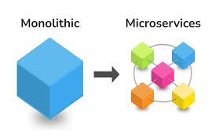

# Microservices



## Qu'est-ce qu'un microservice ?

Les microservices sont une architecture logicielle qui consiste à développer des applications en décomposant le système
en plusieurs services indépendants et autonomes. Chaque service est responsable d'une fonctionnalité spécifique et peut
être développé, testé et déployé séparément des autres services. Cette approche permet de créer des applications plus
flexibles, évolutives et faciles à maintenir.

## Communication réseau entre microservices

Pour que les différents microservices puissent communiquer entre eux, ils doivent utiliser des protocoles de
communication réseau. Les protocoles les plus couramment utilisés sont UDP, TCP et HTTP.

### UDP (User Datagram Protocol)

UDP est un protocole de communication simple et rapide qui ne garantit pas la livraison des données. Il est souvent
utilisé pour les applications qui ont besoin d'une communication rapide mais qui peuvent tolérer des pertes de données
occasionnelles, comme les jeux vidéo en ligne ou la diffusion de vidéos en direct.

### TCP (Transmission Control Protocol)

TCP est un protocole de communication fiable qui garantit la livraison des données dans l'ordre. Il est souvent utilisé
pour les applications qui ont besoin d'une communication fiable, comme les transferts de fichiers ou les transactions
bancaires.

### HTTP (Hypertext Transfer Protocol)

HTTP est un protocole de communication utilisé pour transférer des données sur le Web. Il est souvent utilisé pour les
applications Web qui ont besoin de communiquer avec des serveurs distants.

Exemple :

Imaginons que nous avons deux microservices : un service de gestion des utilisateurs et un service de gestion des
commandes. Le service de gestion des utilisateurs doit pouvoir communiquer avec le service de gestion des commandes
pour vérifier si un utilisateur a le droit de commander un produit. Pour ce faire, les deux services peuvent utiliser
le protocole HTTP pour échanger des messages JSON contenant les informations nécessaires.

```http request
// Requête HTTP envoyée par le service de gestion des utilisateurs
POST /api/orders/checkout HTTP/1.1
Host: orders.example.com
Content-Type: application/json

{
"userId": 12345,
"productId": 67890,
"quantity": 2
}

// Réponse HTTP envoyée par le service de gestion des commandes
HTTP/1.1 200 OK
Content-Type: application/json

{
"success": true,
"message": "Commande validée"
}
```

Dans cet exemple, le service de gestion des utilisateurs envoie une requête HTTP POST au service de gestion des
commandes avec les informations nécessaires pour valider la commande. Le service de gestion des commandes renvoie
ensuite une réponse HTTP avec un message indiquant si la commande a été validée ou non.

### Bus de messages

Un autre moyen de communication entre microservices est l'utilisation d'un bus de messages. Un bus de messages est un
composant logiciel qui permet aux microservices de s'envoyer des messages de manière asynchrone. Les microservices
peuvent publier des messages sur le bus de messages et d'autres microservices peuvent s'abonner pour recevoir ces
messages.

Il existe plusieurs types de bus de messages, tels que RabbitMQ, Apache Kafka et Amazon Simple Notification Service (
SNS). Ces bus de messages offrent différentes fonctionnalités, telles que la persistance des messages, la distribution
des messages à plusieurs abonnés et la possibilité de filtrer les messages en fonction de critères spécifiques.

L'utilisation d'un bus de messages présente plusieurs avantages par rapport aux protocoles de communication réseau
traditionnels. Tout d'abord, elle permet une communication asynchrone entre les microservices, ce qui signifie que les
microservices n'ont pas besoin d'attendre une réponse immédiate pour continuer leur traitement. Ensuite, elle permet une
meilleure scalabilité, car les microservices peuvent être ajoutés ou supprimés sans affecter les autres microservices.
Enfin, elle permet une meilleure résilience, parce que les messages peuvent être stockés temporairement en cas de panne
d'un microservice.

Exemple :

Imaginons que nous avons deux microservices : un service de gestion des utilisateurs et un service de gestion des
notifications. Le service de gestion des utilisateurs doit pouvoir envoyer des notifications aux utilisateurs lorsqu'ils
effectuent certaines actions, comme la création d'un compte ou la modification de leurs informations personnelles. Pour
ce faire, les deux services peuvent utiliser un bus de messages pour échanger des messages JSON contenant les
informations nécessaires.

*Message publié par le service de gestion des utilisateurs (et reçu par les consommateurs)*
```json
{
  "event": "user_created",
  "data": {
    "userId": 12345,
    "email": "john.doe@example.com",
    "firstName": "John",
    "lastName": "Doe"
  }
}
```

Dans cet exemple, le service de gestion des utilisateurs publie un message sur le bus de messages avec les informations
nécessaires pour envoyer une notification à l'utilisateur nouvellement créé. Le service de gestion des notifications
s'abonne au bus de messages pour recevoir ce message et envoie ensuite une notification à l'utilisateur.

> Cet aspect sera revu en détail plus tard dans le module...

## Avantages et inconvénients des microservices

L'architecture microservices présente plusieurs avantages et inconvénients par rapport aux architectures monolithiques
traditionnelles. Voici quelques-uns des principaux avantages et inconvénients de cette architecture :

Avantages :

* **Scalabilité** : Les microservices peuvent être mis à l'échelle indépendamment les uns des autres, ce qui permet de
  mieux gérer les pics de charge et de réduire les coûts d'infrastructure.
* **Résilience** : Si un microservice tombe en panne, les autres microservices peuvent continuer à fonctionner
  normalement, ce qui permet de minimiser les temps d'arrêt et d'améliorer la disponibilité du système.
* **Évolutivité** : Les microservices peuvent être développés, testés et déployés indépendamment les uns des autres, ce
  qui permet de réduire les temps de développement et de déploiement et de faciliter l'intégration de nouvelles
  fonctionnalités.
* **Flexibilité** : Les microservices peuvent être développés dans différents langages de programmation et technologies,
  ce qui permet de choisir la technologie la plus adaptée à chaque fonctionnalité.

Inconvénients :

* **Complexité** : L'architecture microservices est plus complexe à mettre en place et à gérer que les architectures
  monolithiques traditionnelles, ce qui peut entraîner des coûts supplémentaires en termes de développement et de
  maintenance.
* **Latence** : La communication entre les microservices peut introduire une latence supplémentaire, ce qui peut
  affecter les performances du système.
* **Sécurité** : La communication entre les microservices peut être vulnérable aux attaques, il est donc important de
  mettre en place des mesures de sécurité appropriées pour protéger les données sensibles.
* **Gestion des données** : La gestion des données peut être plus complexe dans une architecture microservices, car les
  données peuvent être réparties entre plusieurs microservices. Il est donc important de mettre en place des mécanismes
  de synchronisation et de cohérence des données.