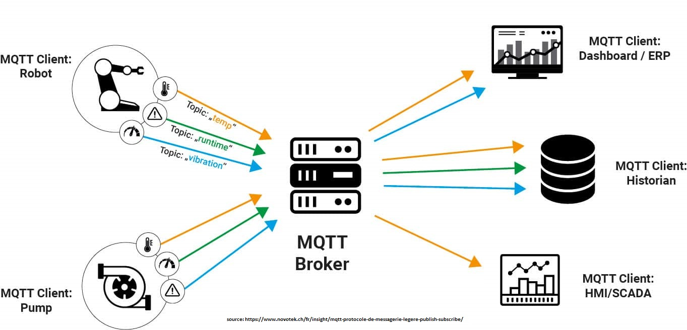

# MQTT

Le protocole MQTT (Message Queuing Telemetry Transport) est un protocole de communication léger conçu pour les systèmes nécessitant des échanges de données rapides et à faible bande passante, comme l'Internet des objets (IoT). 

Développé dans les années 1990, MQTT repose sur une architecture de type "publish-subscribe", où les appareils communiquent via un serveur central appelé "broker".

Dans ce modèle, les clients (appareils) ne communiquent pas directement entre eux. Ils se connectent au broker en TCP/IP et publient des messages sur des topics (sujets) spécifiques. D'autres clients peuvent alors s'abonner à ces topics pour recevoir les messages. Par exemple, un capteur de température peut publier des données sur le topic "moteur/température", et tous les appareils abonnés à ce topic recevront les mises à jour.

Le protocole MQTT est particulièrement adapté aux environnements avec une bande passante limitée ou des connexions instables, car il consomme peu de ressources et peut fonctionner avec un minimum de données. 

## Qualité de Service (QoS)

MQTT offre plusieurs fonctionnalités permettant d'assurer un service malgré des événements imprévus.

### QoS

MQTT offre trois niveaux de QoS en ce qui concerne la livraison des messages :

- QoS 0 : les messages sont envoyés sans garantie de réception.  
- QoS 1 : les messages sont livrés au moins une fois.  
- QoS 2 : les messages sont garantis d'être livrés une seule fois.  

### Last Will and Testament (LWT)

Le Last Will and Testament (LWT) est un mécanisme conçu pour informer les autres appareils lorsque l'un des clients est déconnecté de manière inattendue.

Au moment de sa connxion au broker, le client MQTT peut définir un message LWT qui sera stocké par le broker jusqu'à ce que le client se déconnecte. 

- Si le client se déconnecte correctement (en envoyant un message de fin de session, appelé DISCONNECT), le broker sait qu'il n'est plus actif et le message LWT n'est pas envoyé. 
- Si le client perd sa connexion de façon imprévue (par exemple, en cas de panne de réseau ou de coupure de courant), le broker considère cela comme une déconnexion anormale et publie automatiquement le message LWT sur un topic défini.

### Keep-Alive
Le paramètre Keep-Alive est un intervalle de temps défini par le client MQTT au moment de sa connexion au broker. Ce paramètre indique la fréquence à laquelle le client doit envoyer des messages de type PINGREQ au broker pour signaler qu'il est toujours en ligne. En retour, le broker répond avec un message PINGRESP. Si le broker ne reçoit pas de PINGREQ dans l’intervalle défini, il considère que le client est déconnecté et peut déclencher le message LWT si un LWT est configuré.

### Session Persistante
MQTT offre la possibilité de maintenir une session persistante pour les clients qui se déconnectent temporairement. Lorsqu'un client utilise une session persistante, le broker garde en mémoire certains états importants, comme les abonnements et les messages non délivrés. Cela signifie que si le client se reconnecte plus tard, il pourra récupérer tous les messages publiés sur ses topics d'abonnement pendant sa déconnexion. Ce mécanisme est particulièrement utile pour les appareils qui peuvent se connecter de façon intermittente, comme les capteurs sur batterie.

### Retained Messages (Messages conservés)
Les retained messages permettent de conserver le dernier message publié sur un topic pour les nouveaux clients qui s’abonnent à ce topic après la publication. Si un capteur publie une donnée importante, comme une alerte, cette donnée restera disponible pour tout nouvel abonné, ce qui assure une certaine persistance des informations.

### Bufferisation
Lorsqu'un client perd sa connexion au broker, il peut décider de continuer à fonctionner normalement, ce qui va générer de nouveaux messages à émettre. Ces messages sont stockés localement dans une queue, ils seront envoyés dans le bon ordre au moment où le client se sera reconnecté au broker.

