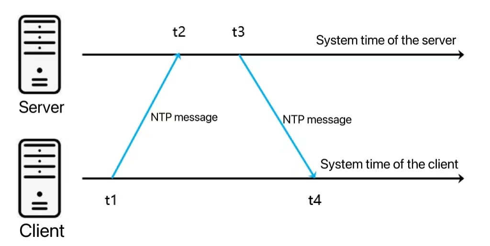
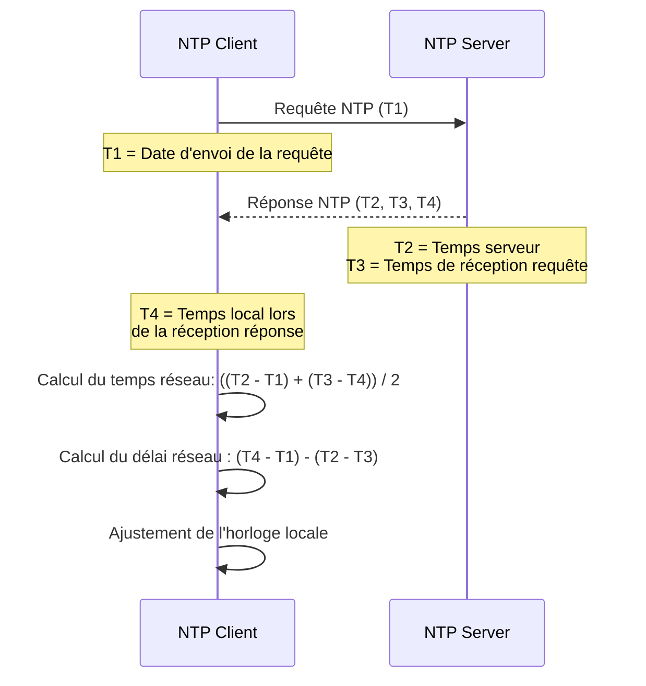

# NTP (Network Time Protocol) et son implication dans un réseau distribué

Le protocole `NTP` est un protocole conçu pour synchroniser les horloges de machines connectées à un réseau, souvent sur
Internet. Il fonctionne en ajustant progressivement l'horloge locale des machines pour qu'elle corresponde à celle de
serveurs de temps fiables. En utilisant NTP, les systèmes distribuent des paquets de synchronisation à intervalles
réguliers, permettant ainsi aux différentes machines de maintenir des horloges proches les unes des autres.

Dans un réseau distribué de nœuds, la synchronisation du temps est essentielle. Sans une heure cohérente entre les
nœuds, la coordination des tâches peut devenir problématique. Par exemple, lorsqu'un ensemble de serveurs collabore pour
exécuter des transactions ou des calculs, il est crucial qu'ils aient une perception temporelle similaire pour éviter
des incohérences dans l'ordre des opérations.

Si les horloges sont désynchronisées, il peut être difficile de déterminer dans quel ordre les événements ont eu lieu.
Prenons le cas d'une base de données distribuée, où différents nœuds ajoutent et modifient des données. Si les horloges
ne sont pas alignées, il peut sembler qu'un événement futur s'est produit avant un événement passé, créant ainsi des
contradictions dans l'état global du système.



> NTP offre une précision de l'ordre de la milliseconde, pour plus de précision, il existe `PTP`

## PTP (Precision Time Protocol)

- PTP est conçu pour des environnements nécessitant une très haute précision, généralement de l’ordre de la
  **microseconde** (µs) voire de la nanoseconde (ns), en particulier dans les réseaux locaux (LAN) optimisés pour la
  synchronisation précise. Cette précision peut atteindre les **sub-microsecondes** dans des configurations
  optimisées.
- PTP est utilisé dans des systèmes critiques comme les réseaux de télécommunications, les systèmes de trading haute
  fréquence, les réseaux industriels (automatisation) et les systèmes audio/vidéo synchronisés.

### Cas d'usage NTP/PTP

- **NTP** :
    - NTP est conçu pour des réseaux à grande échelle, notamment Internet. Il prend en compte la latence et les
      variations du réseau lors du calcul de l’heure. Il utilise une hiérarchie de serveurs NTP pour propager l’heure à
      travers le réseau (structure en couches : Stratum 0 pour les sources de temps primaires comme les horloges
      atomiques, Stratum 1, etc.).
    - Il est robuste et tolère les réseaux de qualité variable avec des retards non prévisibles.

- **PTP** :
    - PTP, en revanche, est optimisé pour les réseaux locaux (LAN) où le contrôle sur les composants réseau est plus
      important. Il nécessite souvent un support matériel dédié pour atteindre des niveaux de précision élevés, comme
      des horloges matérielles dans les équipements réseau (commutateurs, cartes réseau) et le mécanisme de timestamping
      hardware.
    - PTP utilise une hiérarchie de "master" et "slave" clocks. Le "grandmaster clock" (la source de temps la plus
      précise) diffuse l’heure aux autres appareils, qui ajustent leurs horloges en conséquence.

### Comparaison NTP/PTP

| **Caractéristique**      | **NTP**                          | **PTP**                                                                         |
|--------------------------|----------------------------------|---------------------------------------------------------------------------------|
| **Précision**            | Millisecondes (ms)               | Microsecondes à nanosecondes                                                    |
| **Conception**           | Réseau global, grande échelle    | Réseau local (LAN), haute précision                                             |
| **Tolérance aux délais** | Résilient aux retards réseau     | Dépend d’un réseau local contrôlé                                               |
| **Support matériel**     | Logiciel principalement          | Nécessite du support matériel pour une haute précision                          |
| **Applications**         | Serveurs, bases de données, logs | Systèmes critiques : télécoms, trading haute fréquence, automation industrielle |

### Synthèse NTP/PTP

Si la synchronisation à l’échelle de la **milliseconde** est suffisante, **NTP** est généralement le bon choix en raison
de sa simplicité et de sa large adoption. En revanche, pour des applications où la précision à l’échelle de la
**microseconde** est critique, **PTP** est nécessaire.

## Alternative logique

Si l'heure exacte n'est pas nécessaire, il existe plusieurs algorithmes pour que l'ordre des messages suive une échelle
de temps.

### Algorithme de Lamport et problèmes de synchronisation

L'**algorithme de Lamport** tente de résoudre le problème de l'ordre des événements dans les systèmes distribués, où les
horloges physiques peuvent différer. Pour cela, il propose un concept d'horloges logiques. Chaque nœud du réseau
distribué maintient un compteur local qui est incrémenté lorsqu'un événement se produit. Lorsque les nœuds communiquent
entre eux, ils échangent également ces horloges logiques pour garantir que tous les événements puissent être ordonnés
correctement, même sans horloge physique parfaitement synchronisée.

#### Métaphore : l'orchestre sans chef d'orchestre

Imaginez un orchestre où chaque musicien joue sa partie de manière autonome, mais sans chef d'orchestre pour les guider.
Chaque musicien a sa propre montre pour savoir quand commencer et finir de jouer. Le problème survient quand ces montres
sont légèrement décalées. Si le violon commence trop tôt et la flûte trop tard, la symphonie ne sera pas harmonieuse.

Dans cette situation, les musiciens doivent trouver une manière de se coordonner. C'est là que l'algorithme de Lamport
intervient, jouant le rôle d'un mécanisme qui permet aux musiciens d'échanger des informations sur quand ils ont joué
chaque note, et ainsi reconstruire un ordre cohérent de la symphonie, même si leurs montres étaient désynchronisées.

Cependant, même si l'algorithme résout la question de l'ordre des événements, il ne garantit pas que le moment exact où
ces événements se produisent soit le même pour tous les nœuds, seulement qu'ils se passent dans le bon ordre relatif.
L'ajout de NTP dans ce système améliore encore la précision de cette orchestration, mais ne peut pas corriger tous les
problèmes dus aux décalages inhérents à la transmission et au traitement des données.

En résumé, NTP aide à réduire les écarts d'horloge dans un réseau distribué, tandis que l'algorithme de Lamport est un
mécanisme qui assure l'ordre logique des événements malgré ces décalages, permettant ainsi aux systèmes distribués de
fonctionner correctement.

## NTP en pratique

Voici les interactions NTP entre un client et un serveur ([PDF si le diagramme ne s'affiche pas](ntp.pdf)) :



### Synthèse des horodatages :

1. **T1** : Date d'envoi de la requête par le client.
2. **T2** : Date d'envoi de la réponse par le serveur.
3. **T3** : Date de réception de la requête par le serveur.
4. **T4** : Date de réception de la réponse par le client.

### Détail des calculs :

- **Delay (délai réseau)** :
  $
  \text{Delay} = (T4 - T1) - (T2 - T3)
  $

  Le délai réseau mesure le temps de transmission aller-retour. Bien qu'il ne soit pas directement utilisé dans
  l’ajustement de l'heure locale, il permet au client d'évaluer la qualité de la synchronisation. Si le délai est élevé,
  la précision de l’horloge ajustée sera moindre.

- **Offset (décalage de l'horloge)** :
  $
  \text{Offset} = \frac{(T2 - T1) + (T3 - T4)}{2}
  $

  Le décalage d’horloge est utilisé pour ajuster l'horloge locale du client.

### Utilisation du **delay** :

Le **delay** ne modifie pas directement l’ajustement de l'horloge, mais il est utilisé pour **évaluer la fiabilité de la
correction**. Si le délai réseau est élevé, cela signifie que les conditions réseau ne sont pas idéales, et la
correction appliquée pourrait ne pas être précise. Dans de telles conditions, les systèmes NTP peuvent choisir d’ignorer
certaines corrections ou de retarder la synchronisation jusqu’à obtenir de meilleures conditions réseau.

Dans certains cas, les systèmes peuvent également prendre en compte le **delay** pour ajuster la confiance accordée à
l’offset calculé, mais généralement cela ne change pas directement l’ajustement de l’heure locale.

### Exemple de calcul

- **(T2 - T1) = 5 ms** : Le serveur est 5 millisecondes en avance par rapport au client.
- **(T3 - T4) = -3 ms** : Le client est 3 millisecondes en avance sur le serveur pour la réception.

En prenant la moyenne des deux différences, l'algorithme ajuste l'horloge du client pour que celle-ci se rapproche de
celle du serveur en ajoutant ou retirant une fraction du temps (dans cet exemple, l'horloge serait ajustée de
**+1 ms**).

### Calcul sur des horodatages

Lorsque qu'on travaille avec des dates pour synchroniser des horloges ou effectuer des calculs de décalage,
une astuce utile est de **convertir les dates et heures en timestamps (marques de temps) en millisecondes ou
nanosecondes** depuis une époque de référence (généralement le 1er janvier 1970, aussi appelé **Unix Epoch**). Cela
permet de simplifier les calculs sur les dates et d'éviter les complications liées aux fuseaux horaires, aux formats ou
aux unités de temps.

Même si C# offre des outils pour faire des calculs sur des horodatages, voici comment on pourrait faire sans ces
outils :

```csharp
using System;

class NTPExample
{
    static void Main()
    {
        // Simuler les timestamps NTP en millisecondes depuis Unix Epoch
        long T1 = DateTimeOffset.UtcNow.ToUnixTimeMilliseconds(); // Temps d'envoi de la requête (T1)
        
        // Simuler un délai entre les événements
        System.Threading.Thread.Sleep(5); // Simuler un délai réseau de 5ms

        long T3 = DateTimeOffset.UtcNow.ToUnixTimeMilliseconds(); // Temps de réception de la requête par le serveur (T3)

        // Simuler un délai entre la réponse du serveur
        System.Threading.Thread.Sleep(10); // Simuler un autre délai réseau de 10ms

        long T2 = DateTimeOffset.UtcNow.ToUnixTimeMilliseconds(); // Temps d'envoi de la réponse par le serveur (T2)
        long T4 = DateTimeOffset.UtcNow.ToUnixTimeMilliseconds(); // Temps de réception de la réponse par le client (T4)
        
        // Calculer l'offset avec la formule NTP
        long offset = ((T2 - T1) + (T3 - T4)) / 2;
        
        // Affichage des résultats
        Console.WriteLine($"T1 (Envoi de la requête) : {T1} ms");
        Console.WriteLine($"T2 (Envoi de la réponse) : {T2} ms");
        Console.WriteLine($"T3 (Réception de la requête) : {T3} ms");
        Console.WriteLine($"T4 (Réception de la réponse) : {T4} ms");
        Console.WriteLine($"Offset calculé : {offset} ms");

        // Ajuster l'horloge locale avec l'offset
        long localTimeAdjusted = DateTimeOffset.UtcNow.ToUnixTimeMilliseconds() + offset;
        Console.WriteLine($"Horloge locale ajustée : {localTimeAdjusted} ms");
    }
}
```

Et voici un exemple qui utilise directement le type **`DateTime`** et ses opérateurs pour effectuer les calculs
de l'**offset** dans un scénario NTP :

```csharp
using System;

class NTPExample
{
    static void Main()
    {
        // Simuler les horodatages NTP avec DateTime
        DateTime T1 = DateTime.UtcNow; // Temps d'envoi de la requête (T1)
        Console.WriteLine($"T1 (Envoi de la requête) : {T1:HH:mm:ss.fff}");

        // Simuler un délai entre les événements
        System.Threading.Thread.Sleep(5); // Simuler un délai réseau de 5ms

        DateTime T3 = DateTime.UtcNow; // Temps de réception de la requête par le serveur (T3)
        Console.WriteLine($"T3 (Réception de la requête) : {T3:HH:mm:ss.fff}");

        // Simuler un délai entre la réponse du serveur
        System.Threading.Thread.Sleep(10); // Simuler un autre délai réseau de 10ms

        DateTime T2 = DateTime.UtcNow; // Temps d'envoi de la réponse par le serveur (T2)
        Console.WriteLine($"T2 (Envoi de la réponse) : {T2:HH:mm:ss.fff}");

        DateTime T4 = DateTime.UtcNow; // Temps de réception de la réponse par le client (T4)
        Console.WriteLine($"T4 (Réception de la réponse) : {T4:HH:mm:ss.fff}");

        // Calculer l'offset avec la formule NTP en utilisant TimeSpan
        TimeSpan offset = ((T2 - T1) + (T3 - T4)) / 2;

        // Afficher les résultats
        Console.WriteLine($"\nOffset calculé : {offset.TotalMilliseconds} ms");

        // Ajuster l'horloge locale avec l'offset
        DateTime localTimeAdjusted = DateTime.UtcNow + offset;
        Console.WriteLine($"Horloge locale ajustée : {localTimeAdjusted:HH:mm:ss.fff}");
    }
}
```

## Conclusion et considérations

La notion du temps implique de maîtriser le concept logique de celui-ci ainsi que ses détails techniques
afin de pouvoir harmoniser un cluster autour d'une échelle temporelle cohérente.

Au vu de la complexité et de l'importance que le temps a sur un réseau distribué, des tests unitaires sont à prévoir et
pour manipuler le temps d'une application, autant le prévoir **AVANT** !

### Nodatime


Historiquement, cette complexité avait donné naissance au
projet [jodatime](https://www.joda.org/joda-time/quickstart.html)
pour le langage `Java` et pour le C#, des contributeurs ont
créé [nodatime](https://nodatime.org/3.2.x/userguide/rationale).

#### Exemple

##### Programme en Production

Voici un exemple d'un programme qui utilise **`Instant`** via l'horloge système.

```csharp
using NodaTime;

public class TimeSensitiveProgram
{
    private readonly IClock _clock;

    public TimeSensitiveProgram(IClock clock)
    {
        _clock = clock;
    }

    // Méthode qui récupère l'instant actuel et effectue une logique basée sur celui-ci
    public string GetTimeBasedMessage()
    {
        Instant now = _clock.GetCurrentInstant();
        
        // Supposons que la logique dépend de la date actuelle
        if (now < Instant.FromUtc(2024, 1, 1, 0, 0))
        {
            return "Before the new year 2024!";
        }
        else
        {
            return "Welcome to 2024!";
        }
    }
}

class Program
{
    static void Main(string[] args)
    {
        // Instanciation de l'horloge système réelle (SystemClock.Instance)
        IClock systemClock = SystemClock.Instance;

        // Créer une instance du programme avec l'horloge système
        TimeSensitiveProgram program = new TimeSensitiveProgram(systemClock);

        // Appeler la méthode et afficher le message
        string message = program.GetTimeBasedMessage();
        Console.WriteLine(message);
    }
}

```

##### Test Unitaire avec Date Modifiée

Pour tester cette méthode et **modifier la date de base** dans le test unitaire, on utilise **`FakeClock`** pour
simuler une date spécifique.

```csharp
using NUnit.Framework;
using NodaTime;
using NodaTime.Testing;

[TestFixture]
public class TimeSensitiveProgramTests
{
    [Test]
    public void GetTimeBasedMessage_Before2024_ReturnsBeforeNewYearMessage()
    {
        // Initialiser FakeClock à une date avant 2024 (par exemple, le 31 décembre 2023)
        var fakeClock = new FakeClock(Instant.FromUtc(2023, 12, 31, 23, 59));

        // Injecter FakeClock dans le programme au lieu de SystemClock.Instance
        var program = new TimeSensitiveProgram(fakeClock);

        // Appeler la méthode et vérifier le résultat
        string result = program.GetTimeBasedMessage();

        // Vérifier que le message correspond bien à la date simulée (avant 2024)
        Assert.AreEqual("Before the new year 2024!", result);
    }

    [Test]
    public void GetTimeBasedMessage_After2024_ReturnsWelcomeMessage()
    {
        // Initialiser FakeClock à une date après le début de 2024 (par exemple, le 1er janvier 2024)
        var fakeClock = new FakeClock(Instant.FromUtc(2024, 1, 1, 0, 1));

        // Injecter FakeClock dans le programme
        var program = new TimeSensitiveProgram(fakeClock);

        // Appeler la méthode et vérifier le résultat
        string result = program.GetTimeBasedMessage();

        // Vérifier que le message correspond à l'année 2024
        Assert.AreEqual("Welcome to 2024!", result);
    }

    [Test]
    public void GetTimeBasedMessage_AdvanceTime_ReturnsUpdatedMessage()
    {
        // Initialiser FakeClock à une date avant 2024 (le 31 décembre 2023)
        var fakeClock = new FakeClock(Instant.FromUtc(2023, 12, 31, 23, 59));

        // Injecter FakeClock dans le programme
        var program = new TimeSensitiveProgram(fakeClock);

        // Vérifier le message avant 2024
        string resultBefore = program.GetTimeBasedMessage();
        Assert.AreEqual("Before the new year 2024!", resultBefore);

        // Avancer l'horloge de 2 minutes (on sera alors en 2024)
        fakeClock.AdvanceBy(Duration.FromMinutes(2));

        // Vérifier que le message a changé après avoir avancé l'horloge
        string resultAfter = program.GetTimeBasedMessage();
        Assert.AreEqual("Welcome to 2024!", resultAfter);
    }
}
```

### Explication :

1. **Injection d'une horloge (`IClock`)** : Le programme accepte une instance de **`IClock`** (l'horloge utilisée pour
   récupérer l'**`Instant`**). Cela permet d'injecter différentes horloges dans des environnements de test et de
   production.
    - En production, on utilise **`SystemClock.Instance`** pour obtenir l'heure réelle.
    - En test, on utilise **`FakeClock`** pour contrôler la date et le temps.

2. **FakeClock** :
    - Nous créons une instance de **`FakeClock`** dans le test, avec une date de départ spécifique.
    - Le test peut avancer le temps avec **`AdvanceBy()`** pour simuler un délai ou une progression dans le temps.

3. **Tests** :
    - **Premier test** : Simule une date avant 2024 et vérifie que le programme retourne le bon message.
    - **Deuxième test** : Simule une date après 2024 et vérifie que le message change.
    - **Troisième test** : Démarre avant 2024, puis avance l'horloge dans le test pour vérifier que la logique du
      programme s'ajuste correctement en fonction de la nouvelle date.

### Avantages :

- On peut tester le comportement du programme pour différentes dates sans modifier le code en production.
- Les tests sont isolés et ne dépendent pas de l'horloge système réelle, ce qui améliore leur fiabilité.
- On peut simuler des scénarios temporels complexes (comme des retards, des changements de date) de manière
  contrôlée.
