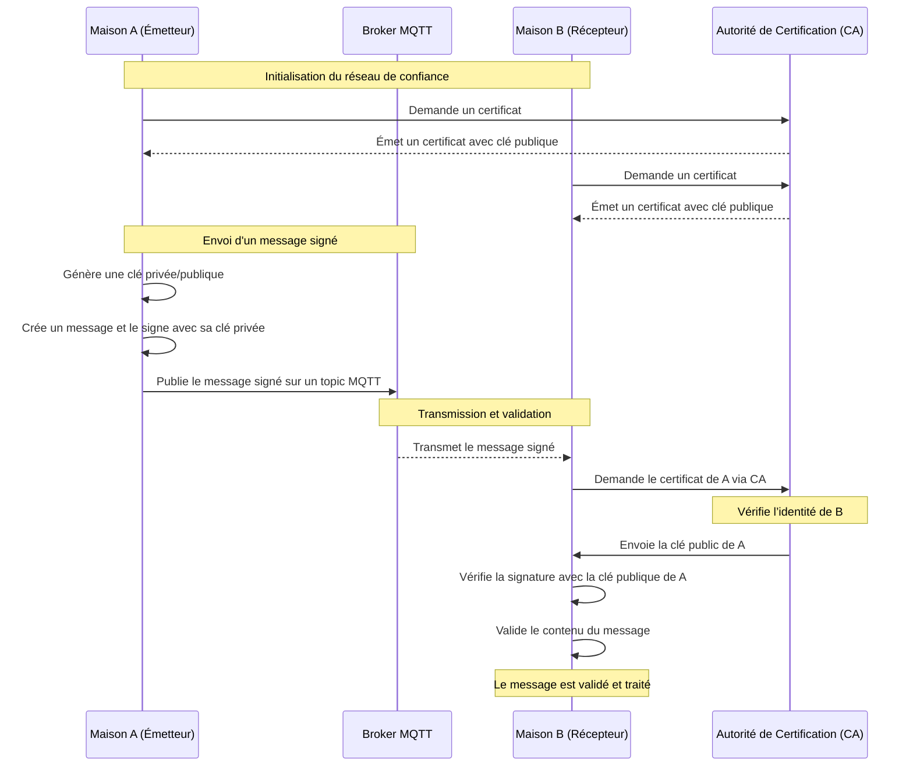

# Réseau de confiance

Un **réseau de confiance** est un modèle dans lequel chaque participant (par exemple, une maison connectée ou un
appareil IoT) accorde sa confiance à d'autres participants sur la base de relations directes ou indirectes. Cette
confiance est essentielle pour assurer la validité des échanges.

## Principes généraux :

1. **Nœuds participants** : Chaque maison ou appareil connecté représente un nœud.
2. **Certificats de confiance** :
    - Les nœuds possèdent des certificats émis par une autorité centrale ou décentralisée.
    - Chaque certificat associe une identité à une clé publique.
3. **Propagation de la confiance** :
    - Les relations de confiance peuvent être directes (maison A connaît maison B) ou transitives (A fait confiance à B,
      qui fait confiance à C).
4. **Validation mutuelle** :
    - Avant de partager des informations sensibles, les nœuds valident leur relation de confiance via des certificats ou
      d'autres mécanismes.

## Exemple d'application

### Contexte :

- Les maisons connectées échangent des **messages MQTT** via un broker central (ou un cluster).
- Ces messages contiennent des informations sur la consommation électrique ou des fichiers multimédias.

### Étapes :

1. **Établissement de la confiance** :
    - Chaque maison s'enregistre auprès d'une autorité de certification (CA) pour obtenir un certificat X.509, qui
      contient sa clé publique (PKI, par exemple Verisign...).
    - Ces certificats peuvent être validés par d'autres maisons avant de commencer les échanges.

2. **Signature des messages MQTT** :
    - Les messages envoyés via le broker sont **signés** avec la clé privée de l’émetteur.
    - Exemple : Une maison publie un message sur le **topic "powercher"**, accompagné de la signature de son
      contenu.

3. **Vérification au niveau du broker ou des abonnés** :
    - Les abonnés (maisons connectées) utilisent la clé publique de l’émetteur (disponible via le certificat) pour
      valider la signature et s'assurer que :
        - Le message provient bien de l’émetteur déclaré.
        - Les données n’ont pas été modifiées en transit.

4. **Gestion des fichiers multimédias** :
    - Les fichiers sont hachés (ex. SHA-256) avant transmission.
    - Le hachage est signé.

### Diagramme de séquence

## Défis et solutions

1. **Gestion des certificats** :
    - Problème : Distribution et révocation des certificats.
    - Solution : Utiliser un protocole comme **OCSP (Online Certificate Status Protocol)** pour vérifier l’état des
      certificats.

2. **Latence et overhead** :
    - Problème : Les opérations cryptographiques peuvent augmenter la latence.
    - Solution : Optimiser les algorithmes (ex. ECDSA au lieu de RSA) et utiliser des matériels dédiés (ex. puces TPM).

3. **Confiance initiale** :
    - Problème : Établir un réseau de confiance initial sans point central fort.
    - Solution : Modèle hybride avec une autorité initiale décentralisée ou une blockchain.

