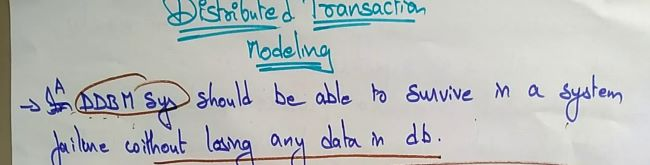
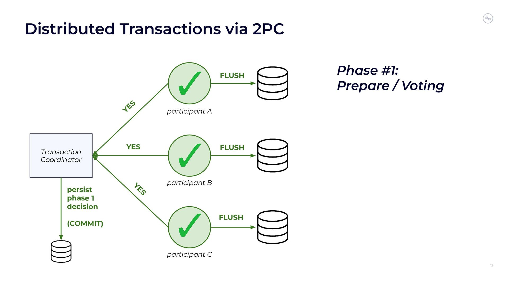
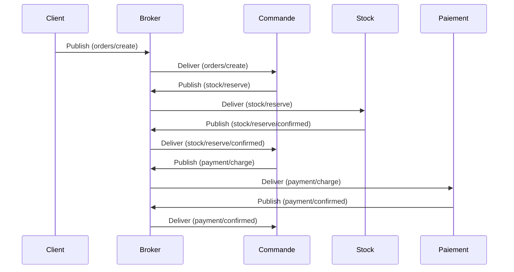

# Transactions

Les transactions jouent un rôle crucial pour garantir la **consistance** des données
entre différents services ou systèmes. La notion de transaction est **étroitement liée à [l’idempotence](idempotence.md)**, car elles visent
toutes deux à garantir que les opérations soient exécutées de manière fiable et cohérente, même en cas de défaillances.

## Qu'est-ce qu'une Transaction ?

Une transaction est une unité logique de travail composée d'une ou plusieurs opérations qui doivent être exécutées selon
les propriétés **ACID** (Atomicité, Cohérence, Isolation, Durabilité) :

1. **Atomicité** : Toutes les opérations d'une transaction doivent réussir ou échouer ensemble. Aucune opération
   partielle n'est autorisée.
2. **Cohérence** : L'état du système reste valide avant et après la transaction.
3. **Isolation** : Les modifications d'une transaction ne sont pas visibles pour d'autres transactions avant leur
   validation (commit).
4. **Durabilité** : Une fois validée, une transaction est persistée et son effet est permanent, même en cas de panne.

Dans une architecture distribuée, appliquer ces propriétés devient plus complexe, car plusieurs systèmes ou services
peuvent être impliqués.

## Transactions dans une Architecture Distribuée

Déjà pas facile à résoudre entre 2 interlocuteurs (par exemple un client et un broker), dans une architecture distribuée,
une transaction peut impliquer plusieurs échanges entre différents microservices, ce qui nécessite des mécanismes pour 
garantir l'intégrité des données. Voici les principaux concepts et implications :

### 1. **Transactions Distribuées**

Une transaction distribuée englobe plusieurs systèmes. Par exemple, dans une application e-commerce :

- Le client passe une commande (service 1).
- Le stock est mis à jour (service 2).
- Le paiement est validé (service 3).

Chaque sous-opération doit réussir pour que la transaction complète soit validée. Si une sous-opération échoue, toutes
les autres doivent être annulées (rollback).

#### Problème : Coordination

- La coordination des transactions entre services nécessite un **coordinateur de transactions distribué**, souvent basé
  sur un protocole comme **Two-Phase Commit (2PC)**.

#### Inconvénients :

- **Complexité élevée** : Le 2PC est difficile à implémenter et peut entraîner des blocages.
- **Latence accrue** : Les validations entre systèmes prennent du temps.
- **Faible résilience** : Si le coordinateur échoue, la transaction peut rester bloquée.

### 2. **Transactions Compensatoires (Sagas)**

Plutôt que d'utiliser des transactions ACID complexes dans une architecture distribuée, une approche populaire est celle
des **sagas** (terme des auteurs qui indique une transaction 'longue'), où chaque étape d'une transaction peut être 
**compensée** par une action inverse en cas d'échec.

#### Exemple :

1. **Étape 1** : Créer une commande (service 1).
2. **Étape 2** : Réserver le stock (service 2).
3. **Étape 3** : Débiter le client (service 3).
4. **Compensation** : Si l'étape 3 échoue, les étapes 1 et 2 doivent être annulées :
    - Supprimer la commande.
    - Libérer le stock.

#### Avantages des sagas :

- **Résilience** : Moins de dépendance à un coordinateur central.
- **Scalabilité** : Chaque service gère ses propres compensations.
- **Simplicité** : Plus facile à implémenter dans des systèmes distribués.

#### Inconvénients :

- **Complexité logique** : Chaque étape doit définir des actions compensatoires.
- **Visibilité** : Les états intermédiaires peuvent être visibles avant que la transaction ne soit complète.

### 3. **Rôle de l'Idempotence**

L'idempotence est essentielle pour gérer les échecs dans les transactions distribuées. En cas de retransmission ou de
reprise après un échec, chaque étape d'une transaction doit pouvoir être répétée sans provoquer d'effet indésirable.

#### Exemple :

- Si une requête pour débiter un client est envoyée deux fois, le service de paiement doit détecter qu'il s'agit de la
  même transaction et éviter un double débit.

#### Stratégies pour l'idempotence :

- **Identifiants uniques** : Chaque étape est identifiée par un ID unique, permettant de détecter et ignorer les
  doublons.
- **Stockage des états** : Les services doivent enregistrer les transactions déjà traitées pour éviter les répétitions.

### Gestion des Transactions dans une Architecture Distribuée

#### Modèle 1 : Transactions Centralisées (ACID)

- Toutes les opérations sont regroupées dans une transaction globale.
- Utilisation d'un **transaction manager**.
- Approprié pour les systèmes monolithiques ou faiblement distribués.

#### Modèle 2 : Transactions Distribuées (2PC)

- Coordination entre plusieurs services via un protocole comme **2PC**.
- Utilisé dans les architectures où la consistance forte est nécessaire.

#### Modèle 3 : Sagas (Transactions Asynchrones)

- Chaque service exécute sa partie de la transaction de manière indépendante.
- Si une étape échoue, des actions compensatoires sont déclenchées.
- Approprié pour les architectures de microservices.

### Recommandations

1. **Utiliser l'idempotence** :
   Chaque étape d'une transaction doit être idempotente pour éviter les duplications et garantir la résilience.

2. **Privilégier les Sagas** :
   Les sagas sont mieux adaptées aux architectures distribuées modernes, offrant un compromis entre simplicité et
   consistance.

3. **Monitorer les états intermédiaires** :
   Utilisez un journal ou une base de données pour suivre l'état de chaque étape d'une transaction.

4. **Adopter des outils appropriés** :
    - **Outbox Pattern** : Pour garantir la livraison des messages en cas de panne.
    - **Middleware transactionnel** : Pour encapsuler les transactions et gérer les échecs automatiquement.

En combinant **idempotence** et **transactions compensatoires**, vous pouvez concevoir des systèmes distribués robustes
qui garantissent la cohérence et la résilience face aux défaillances.

### Transactions et Idempotence avec MQTT dans une Architecture Distribuée

L'intégration de **transactions** dans une architecture distribuée utilisant **MQTT** nécessite une gestion rigoureuse
pour garantir la cohérence des données et la résilience en cas de défaillances. Voici comment appliquer ces concepts en
combinant idempotence et transactions compensatoires.

### Principes des Transactions avec MQTT

1. **Nature asynchrone** :
   MQTT repose sur un modèle de publication/souscription, ce qui le rend asynchrone par nature. Les transactions doivent
   être coordonnées entre producteurs et consommateurs.

2. **Idempotence** :
   Les messages reçus par les consommateurs doivent être traités de manière idempotente pour éviter des modifications
   incorrectes en cas de retransmission.

3. **Sagas** :
   Les **transactions compensatoires** (sagas) sont bien adaptées aux architectures avec MQTT, car chaque service peut
   publier des messages pour confirmer ou annuler une étape.

### Cas d'utilisation : Création d'une commande en trois étapes

1. **Créer une commande** (Service Commande, publié sur `orders/create`).
2. **Réserver le stock** (Service Stock, publié sur `stock/reserve`).
3. **Valider le paiement** (Service Paiement, publié sur `payment/charge`).

Si une étape échoue, les étapes précédentes doivent être compensées.

### Diagramme des Échanges MQTT dans un scénario optimiste

