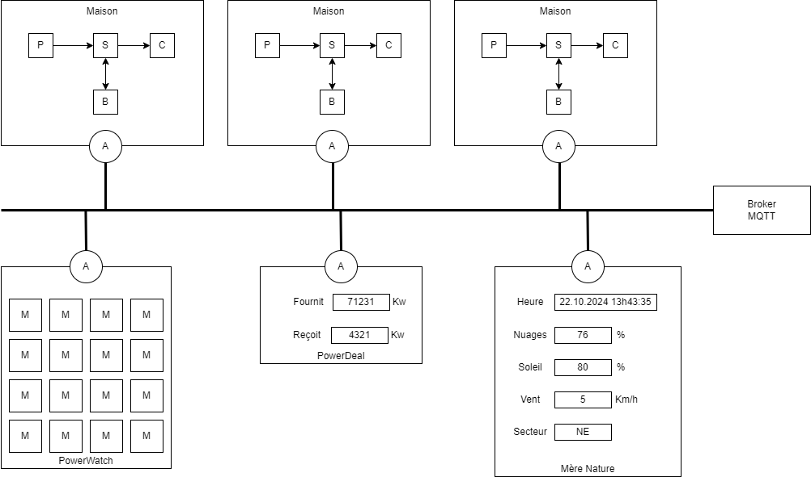

# MQTT

## Théorie
- [MQTT](../supports/mqtt.md)

- [kahoot A](https://create.kahoot.it/share/mqtt/8545db98-717d-4ecb-9e2f-1349eb200161)
- [Kahoot B](https://create.kahoot.it/details/c8177a44-0898-44e5-9c5b-4d72099a28be)

## Pratique

- [Footchat](../activites/footchat/README.md)

### Powercher

#### Setup
- Forker le repo [Powercher](https://github.com/ETML-INF/powercher)
- Si la question vous est posée, choisissez l'option "pour contribuer"!

#### Hello Powercher

- Recevoir les messages de Mère nature
- Afficher l'heure diffusée

#### Catalogue
- Contribuer au [catalogue d'appareils électriques](../activites/powercher_catalog/README.md)

- Poser les bases de votre maison
  - Dans le projet Frontend, créez une copie du formulaire `HouseUI` 
  - Renommez cette copie `HouseUI_xxx` où `xxx` sont vos initiales
  - Modifiez `BootstrapUI` pour ouvrir votre maison

#### Advanced Powercher
En s’aidant du dépôt de la [librairie MQTTNet](https://github.com/dotnet/MQTTnet/tree/master), améliorer
les éléments suivants :

- Les messages transmis sont aussi reçus par le client qui l’a émis => corriger cela
- LWT n’est pas pris en compte, ajouter cette fonctionnalité :
  - Une maison détectée comme "morte" envoie un message d’au revoir aux autres (au travers de LWT) avec une citation philosophique.
  - Chaque maison observe une minute de silence en son honneur...

