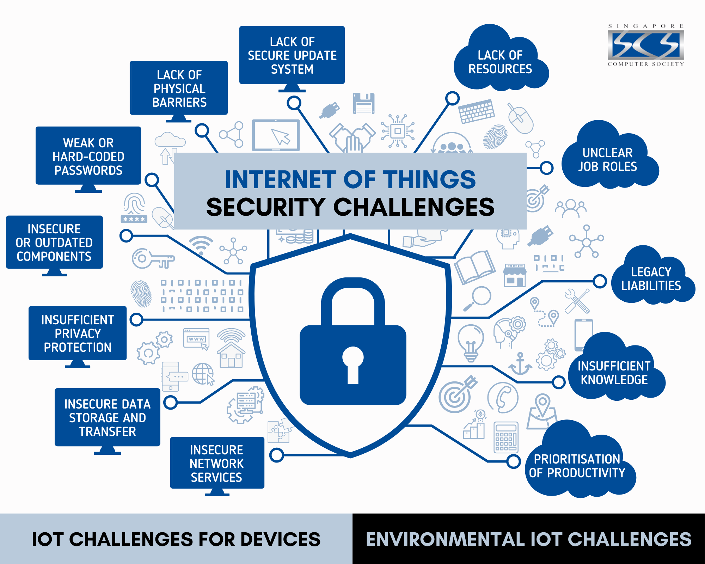

# Sécurité dans un réseau distribué

## 2 éléments clés
Malgré les opportunités présentées dans l’image, nous allons nous limiter à 2 éléments clés 🔑 :

1. Confidentialité
2. Réseau de confiance

## Théorie 📖
- [Confidentialité](../supports/confidentialite.md)
- [Réseau de confiance](../supports/reseau-confiance.md)

## Pratique 👷

### PowerCher

Définir une clé de chiffrement symétrique commune et chiffrer les messages.

Voir [consignes](../activites/aie_confiance/)
